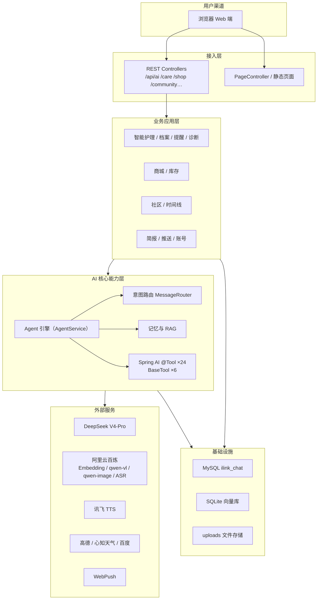

# Sekai PetPlant · AI 宠物 / 绿植护理平台

一个以 **AI Agent 为核心**的一站式宠物与绿植智能护理 Web 平台：覆盖养护问答、AI 识图诊断、护理档案与提醒、知识库 RAG、商城库存、社区分享、每日简报、数据观测等全链路场景。

> 当前版本已彻底移除微信个人号（ILink）与公众号接入，**专注 Web 端**，前后端一体、开箱即用。

## 在线地址

生产演示环境（阿里云）：<http://101.37.254.73:8080>

本地开发环境：<http://localhost:8080>

---

## 项目定位

针对宠物主人和植物养护人群的常见痛点——**不会养、不懂病、容易忘、找不到服务**，Sekai PetPlant 把以下能力收敛到一个 AI 助手里：

- 不会养 → 对话即顾问：AI 回答宠物喂养、植物浇水施肥、季节护理等专业问题；
- 不懂病 → 拍照即诊断：上传照片识别植物病虫害、宠物皮肤病，并给出处置建议；
- 容易忘 → 定时即提醒：浇水、疫苗、喂药等护理提醒，到期通过浏览器 WebPush 推送；
- 找不到服务 → 一问即导航：查询附近宠物医院 / 植物医院 / 园艺店，结果附高德导航链接；
- 想记录 → 一键建档：宠物 / 植物成长档案、护理记录、用药与疫苗台账、成长时间线。

---

## 核心功能

### 1. AI Agent 智能助手（核心亮点）

系统内置两套对话链路，均围绕“意图识别 → 记忆检索 → 工具调用 → 结果生成”的 Agent 循环工作：

- **自研 Agent 引擎（`AgentService`）**：多轮对话编排、意图路由（`MessageRouter`）、对话历史 + RAG 上下文注入、`BaseTool` 工具循环执行，120 秒超时保护、单轮最多 5 次工具迭代；
- **Spring AI 工具对话（`ToolCallingService`）**：24 个 `@Tool` 注册为模型可用函数，支持多工具顺序调用（如“查杭州天气 → 生成西湖风景图”），工具执行结果自动回填对话上下文；
- **流式输出**：`/api/ai/chat/stream` 以 SSE 打字机效果返回，对话体验更流畅；
- **语音输入**：聊天页麦克风录音 → ffmpeg 转 WAV → DashScope ASR 语音识别成文字；
- **多模态工具**：图片分析、图片生成 / 编辑、文档解析、语音合成，工具结果（图片 / 音频）直接渲染在聊天流中。

### 2. 工具调用体系（Agent 的“手”）

系统维护两套可被 Agent 调用的工具，全部可观测、可统计：

| 体系 | 数量 | 说明 |
| --- | --- | --- |
| Spring AI `@Tool` 方法 | 24 | 天气、图像、护理健康、搜索、语音等业务能力，注册后由大模型按需调用 |
| 自研 `BaseTool` 实现 | 6 | 文件分析、图像分析 / 编辑 / 生成、TTS、网页搜索，供自研 Agent 引擎调用 |

24 个 `@Tool` 按功能分为 **8 组**，系统会自动生成“分组默认系统提示词”帮助模型更快选中正确工具：

| 分组 | 代表工具 |
| --- | --- |
| 实时天气 | `getWeather` `queryWeather` `weatherAlert` |
| 图像多模态 | `analyzeImage` `generateImage` `editImage` `compareImages` |
| 文档 / 文件分析 | `analyzeFile` |
| 语音合成 | `synthesizeSpeech` |
| 联网搜索 | `webSearch` `professionalSearch` |
| 附近服务 | `searchNearbyService` |
| 时间查询 | `getCurrentTime` |
| 护理 / 健康管理 | `diagnoseDisease` `triageSymptoms` `queryPetCare` `queryPlantSafety` `queryFoodSafety` `saveMedication` `checkMedication` `generateCarePlan` `createCareReminder` `completeCareReminder` `listCareReminders` |

每次工具调用都会记录 trace（工具名、参数摘要、耗时、结果状态），并落库到 `tool_call_logs`，供数据观测面板统计。

### 3. 记忆与 RAG

- **对话记忆**：会话与消息持久化到 MySQL，采用“窗口截断 + 超阈值自动语义摘要”控制上下文成本，避免长对话丢失关键信息；
- **文档知识库（RAG）**：知识库后台（`/kb`）上传 PDF / Word / Excel / PPT / 图片等 → 自动分块 → Embedding 向量化 → 存入 SQLite 向量库 → 对话时按相似度检索 Top-K 片段注入提示词，让 AI 基于私有资料回答；
- **多级召回**：工具模式支持“对话历史 → 向量检索 → 工具实时结果”的多级信息融合。

### 4. 智能护理中心

- 宠物 / 植物档案：`/api/pet`、`/api/plant` 建档、编辑、删除；
- 护理记录：`/api/care/records` 记录浇水、喂药、疫苗等操作；
- 护理提醒：`/reminders` 增删提醒，到期由定时任务通过 WebPush 推送到浏览器（支持每日 / 每周 / 每月重复）；
- AI 识图诊断：`/api/care/identify`、`/api/disease/diagnose`，支持植物病虫害与宠物皮肤病两类识别，诊断历史可回看；
- 护理问答：`/api/care/qa` 基于专业知识库回答喂养、毒性、疾病等养护问题，并支持多轮追问。

### 5. 知识库后台

`/kb` 页面提供上传文档、查看知识条目、按来源删除等管理能力，是 RAG 的资料入口。

### 6. 图片中心与媒体管理

- AI 生成的图片 / TTS 音频 / 上传分析图按用户归档到 `media_assets`；
- `/gallery` 支持按类型筛选、预览放大与删除；
- 图片 / 音频文件存放在 `uploads/` 目录，通过 `/uploads/**` 提供访问（需登录鉴权）。

### 7. 业务功能模块

- **商城**：`/shop` 商品浏览、发布（`/shop-publish`），分类管理；
- **库存**：`/inventory` 出入库、库存盘点、低库存预警；
- **社区**：`/community` 发帖、评论、点赞、标签筛选；
- **成长时间线**：`/timeline` 记录里程碑，支持自动打点与 AI 小结；
- **每日简报**：每天定时生成养护简报并 WebPush 推送；
- **数据观测**：`/stats` 展示平台概览、工具调用排行与调用趋势（数据来自 `tool_call_logs`）。

### 8. 账号与安全

- 注册 / 登录 / 登出（Session）；
- `WebAuthInterceptor` 统一鉴权：`/api/**`、`/uploads/**` 需登录，未登录返回 401；
- 业务数据按 `user_id` 归属隔离，档案、记录、提醒、图片均校验归属；
- 敏感词过滤（`SensitiveWordFilter`）防止不合规内容入库。

---

## 技术架构



关键设计原则：

- **业务与 AI 解耦**：业务模块不直接依赖具体大模型厂商，通过对话服务与工具层间接调用；
- **工具即能力**：新增一个 `@Tool` 方法即可让 AI 获得新能力，无需改动对话主链路；
- **记忆分源存储**：会话记忆在 MySQL，向量知识在 SQLite，各自职责单一；
- **自动建表**：JPA `ddl-auto=update` + 启动期自定义建表脚本，无需手工维护 SQL；
- **可观测**：工具调用日志落库，统计面板可直接反映 AI 实际“干活”情况。

---

## 项目结构

```text
src/main/java/com/example/demo/
├── agent/              # 自研 Agent 引擎：AgentService、工具基类与 6 个 BaseTool
├── ai/                 # AI 对话层：Controller、流式 SSE、24 个 @Tool、工具调用服务
├── chat/               # 对话记忆持久化、语义摘要、RAG 向量库
├── kb/                 # 知识库后台：上传、分块、向量化、检索
├── aicare/             # 宠物 / 植物档案（/api/pet、/api/plant）
├── care/               # 护理记录、识图诊断、护理问答、提醒服务
├── disease/            # 植物病虫害 / 宠物皮肤病识别
├── gallery/            # 图片中心（媒体资产列表 / 删除）
├── imagegen/           # 阿里云图像生成
├── vision/             # 阿里云视觉分析
├── asr/                # 阿里云语音识别（录音转文字）
├── tts/                # 讯飞语音合成
├── community/          # 社区：帖子、评论、点赞
├── timeline/           # 成长时间线
├── ebusiness/          # 商城（商品 / 分类）
├── inventory/          # 库存管理
├── briefing/           # 每日简报生成
├── push/               # WebPush 浏览器推送
├── stats/              # 数据观测：工具调用日志与统计接口
├── auth/               # 注册 / 登录 / 会话
├── router/             # 意图路由（MessageRouter）
├── weather/            # 心知天气接入
├── service/            # 高德地图、搜索等外部服务封装
├── config/ core/       # 拦截器、Web 配置、文件服务等基础设施
├── utils/              # 通用工具
└── web/                # 页面路由（PageController）
```

前端为纯静态页面（无构建链），位于：

```text
src/main/resources/static/
├── index.html           # 登录前落地页
├── login.html register.html   # 登录 / 注册
├── home.html            # 登录后工作台
├── chat.html            # AI 对话（支持工具模式 / 语音输入 / SSE 流式）
├── care.html            # 护理中心
├── disease.html         # 识图诊断
├── gallery.html         # 图片中心
├── kb.html              # 知识库
├── reminders.html       # 护理提醒
├── briefing.html        # 每日简报
├── shop.html shop-publish.html  # 商城
├── inventory.html       # 库存
├── community.html       # 社区
├── timeline.html        # 成长时间线
├── stats.html           # 数据观测
├── css/ js/             # 公共样式与脚本、PWA Service Worker
└── error/404.html
```

---

## 技术栈

| 分类 | 选型 |
| --- | --- |
| 语言 / 框架 | Java 21 · Spring Boot 3.5 · Spring MVC · Spring AI 1.0.9 |
| 数据层 | MySQL 8（业务数据 `ilink_chat`）· SQLite（RAG 向量库）· Spring Data JPA + JDBC |
| 大模型 | DeepSeek V4-Pro（对话）· 阿里云百炼：Embedding、qwen-vl 视觉、qwen-image 图像生成、ASR 语音识别 |
| 外部服务 | 讯飞 TTS · 高德地图 · 心知天气 · 百度搜索 · WebPush 浏览器推送 |
| 构建部署 | Maven · GitHub Actions（push main 自动构建校验）· 阿里云 + systemd |

---

## API 概览

所有 `/api/**` 与 `/uploads/**` 除登录 / 注册外均需登录会话。

| 模块 | 端点 | 说明 |
| --- | --- | --- |
| 账号 | `/api/auth/register` `/login` `/logout` `/me` | 注册、登录、登出、当前用户 |
| AI 对话 | `/api/ai/chat` `/api/ai/chat/stream` | 普通对话 / SSE 流式对话 |
| AI 工具模式 | `/api/ai/chat-with-tools` | 工具对话（可选 systemPrompt / allowedTools） |
| 工具清单 | `/api/ai/tools/registered` | 查看已注册工具 |
| AI 护理流程 | `/api/ai/care/workflow` `/triage` `/reminder…` `/records…` `/plan/generate` | Agent 驱动的护理工作流 / 分诊 / 提醒 / 用药记录 / 护理计划 |
| 语音识别 | `POST /api/asr/transcribe` | 上传录音转文字 |
| 宠物 / 植物档案 | `/api/pet/**` `/api/plant/**` | 档案增删改查 |
| 护理 | `/api/care/identify` `/targets/**` `/records/**` `/qa` | 识图、档案记录、护理问答 |
| 识病诊断 | `/api/disease/diagnose` `/history` | 拍照诊断与历史 |
| 知识库 | `POST /api/kb/upload` `GET /api/kb/list` `DELETE /api/kb/{sourceId}` | 上传、列表、删除知识条目 |
| 文件 | `/api/file/process` `/api/file/qa` | 文件解析与基于文件问答 |
| 图片中心 | `/api/gallery/list` `/api/gallery/{id}` | 媒体资产列表 / 删除 |
| 推送 | `/api/push/subscribe` `/unsubscribe` `/test` | WebPush 订阅管理 |
| 商城 | `/api/shop/**` `/api/shop/category/**` | 商品与分类 |
| 库存 | `/api/inventory/**` | 库存条目、出入库、预警 |
| 社区 | `/api/community/posts…` `/tags` | 帖子、评论、点赞 |
| 时间线 | `/api/timeline/**` | 成长记录、里程碑 |
| 简报 | `/api/briefing/generate` | 简报生成 |
| 数据观测 | `/api/stats/overview` `/tool-ranking` `/trend` | 平台概览、工具排行、调用趋势 |

---

## 快速开始（本地开发）

### 环境要求

- JDK 21
- Maven 3.9+（项目同时提供 Maven Wrapper）
- MySQL 8.x
- ffmpeg（可选，语音输入转码需要）

### 1. 初始化数据库

```sql
CREATE DATABASE ilink_chat DEFAULT CHARACTER SET utf8mb4;
```

应用首次启动会自动执行建表 / 升级（JPA `ddl-auto=update` + 内置 SQL 初始化器），无需手工建表。

### 2. 配置密钥（不要提交）

仓库内 `application.properties` 中的密钥使用环境变量占位。本地开发建议在项目根目录新建 `application-local.properties`（已 gitignore）：

```properties
spring.datasource.password=你的MySQL密码
dashscope.api-key=sk-xxx            # 对话模型（DeepSeek V4-Pro 走百炼兼容接口）
dashscope.embedding.api-key=sk-xxx  # Embedding / 视觉 / 生图
xunfei.tts.app-id=xxx
xunfei.tts.api-key=xxx
xunfei.tts.api-secret=xxx
weather.api.api-key=xxx             # 心知天气
amap.api-key=xxx                    # 高德地图
baidu.search.api-key=xxx
webpush.vapid.public-key=xxx
webpush.vapid.private-key=xxx
```

也可以在环境中注入同名环境变量（配置项名见下表），无需本地文件。

### 3. 启动

```bash
./mvnw spring-boot:run
# 或打包后运行
mvn -B -DskipTests package
java -jar target/demo-0.0.1-SNAPSHOT.jar
```

访问 <http://localhost:8080>，注册账号后即可使用全部功能。

### 4. 关键配置项

| 配置项 | 用途 |
| --- | --- |
| `spring.datasource.url` | MySQL 连接串（默认 `localhost:3306/ilink_chat`） |
| `dashscope.*` | 大模型对话 / Embedding / 视觉 / 图像 / ASR 的密钥与模型 |
| `chat.memory.*` | 对话记忆窗口、摘要阈值 |
| `chat.vectorstore.*` | RAG 检索开关、Top-K、相似度阈值 |
| `weather.api.*` | 心知天气 |
| `amap.*` | 高德地图 |
| `xunfei.tts.*` | 讯飞语音合成 |
| `baidu.search.*` | 百度搜索 |
| `webpush.vapid.*` | 浏览器推送密钥对 |
| `spring.ai.openai.*` | Spring AI OpenAI 兼容通道（基址指向百炼 / DeepSeek） |

---

## 打包与部署

### GitHub Actions CI

仓库已配置 `.github/workflows/build.yml`，每次 push 到 `main` 自动执行 Maven 打包校验，保证提交可构建。

### 手动部署到阿里云

```bash
# 1. 本地打包
mvn -B clean package -DskipTests

# 2. 上传新版本（先不覆盖当前运行 jar）
scp target/demo-0.0.1-SNAPSHOT.jar root@<服务器IP>:/opt/ilink/demo-0.0.1-SNAPSHOT.jar.new

# 3. 服务器上备份 → 替换 → 重启（systemd 服务名 ilink）
ssh root@<服务器IP> "
  cp /opt/ilink/demo-0.0.1-SNAPSHOT.jar /opt/ilink/demo-0.0.1-SNAPSHOT.jar.bak-$(date +%Y%m%d) &&
  mv /opt/ilink/demo-0.0.1-SNAPSHOT.jar.new /opt/ilink/demo-0.0.1-SNAPSHOT.jar &&
  chown admin:admin /opt/ilink/demo-0.0.1-SNAPSHOT.jar &&
  systemctl restart ilink
"
```

服务器密钥文件位于 `/opt/ilink/application-local.properties`（以 `spring.config.import` 方式加载，不随 jar 提交）。

部署后可用以下命令快速验证：

```bash
systemctl is-active ilink
curl -s -o /dev/null -w "%{http_code}\n" http://127.0.0.1:8080/home
tail -n 30 /opt/ilink/app.log
```

---

## 设计文档

更完整的架构图、Agent 设计、记忆与 RAG 原理、鉴权设计、Java 学习指南见 `落地文档/` 目录：

- [项目介绍与记忆 RAG 系统设计](落地文档/项目介绍与记忆RAG系统设计.md)
- [Agent 核心能力设计介绍](落地文档/Agent核心能力设计介绍.md)
- [Agent 执行引擎核心机制](落地文档/Agent执行引擎核心机制.png)
- [Agent 工具调用体系](落地文档/Agent工具调用体系.md)
- [Web 端功能介绍](落地文档/Web端功能介绍.md)
- [鉴权与安全设计](落地文档/鉴权与安全设计.md)
- [架构图（六层解耦）](落地文档/架构图-六层解耦.md)
- [Java 学习指南（基于本项目代码）](落地文档/Java学习指南-基于本项目代码.md)

---

> 提示：本项目密钥（`application.properties`、`application-local.properties`、服务器本地配置）均为敏感文件，请勿提交或外传。
