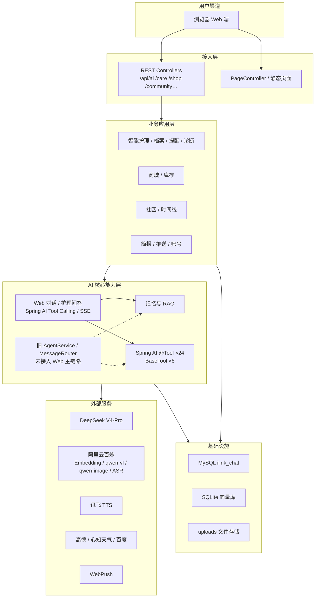

# Sekai PetPlant · AI 宠物 / 绿植护理平台

> 最近更新：2026-10-08（阶段 0.1 至 1 已完成并部署生产；阶段 2.1 流式与护理入口 RAG 接线、阶段 2.2 受控只读召回观测已合入 `main`，本地全量测试 `78/78` 通过，生产仍以 `f6172a8` 为运行基线）

一个以 **AI Agent 为核心**的一站式宠物与绿植智能护理 Web 平台：覆盖养护问答、AI 识图诊断、护理档案与提醒、知识库 RAG、商城库存、社区分享、每日简报、数据观测等全链路场景。

> 当前版本已彻底移除微信个人号（ILink）与公众号接入，**专注 Web 端**，前后端一体、开箱即用。

## 在线地址

正式环境（阿里云，Nginx + HTTPS）：<https://sekaipetplant.com> / <https://www.sekaipetplant.com>

本地开发环境：<http://localhost:8080>

---

## 当前优化进度

| 阶段 | 状态 | 说明 |
| --- | --- | --- |
| 第一批：安全与运行基线 | 主体完成，剩余项暂缓 | 密钥外置、401 统一响应、Session Cookie、CORS、CSRF 来源校验、上传校验、安全响应头、Nginx HTTPS、域名备案和端口收敛已完成；密钥轮换与全局限流暂缓 |
| 第二批：AI 评测基线 | 已完成第一版与 P0 复测，并在生产复测 | 已建立独立 `TEST/` 评测包、12 条冒烟题和 40 条正式题；生产正式题质量通过率 `100.00%` |
| 第三批：记忆与 RAG | 阶段 2 进行中 | 阶段 0 至 1 已完成并部署生产；阶段 2.1 已把流式正式入口接入公共知识库与历史对话检索；阶段 2.2 已提供受控、只读、可审计的召回明细接口；真实知识导入和 `Recall@K` 尚未完成 |
| 第四批：UI 与范围收敛 | 未开始 | 后续处理旧入口、公共前端模块和核心路径简化 |
| 第五批：工程清理与可观测 | 未开始 | 后续处理死代码、统一异常、健康检查和监控 |

2026-10-06 已在当前 `main` 提交 `0e3ab17` 上完成 12 条冒烟题和 40 条正式题复测：共 56 次请求，52 个质量评分样本，51 个通过，质量通过率 `98.08%`；关键事实覆盖率 `99.04%`，工具选择准确率 `100.00%`，工具执行成功率 `100.00%`，拒答边界得分 `100.00%`，基础设施失败 `0`。多轮记忆最终轮达到 `4/4`，高风险题 `tool-006` 达到 `3/3`。总延迟均值约 `22.08 秒`，P95 为 `63.55 秒`。

对照第一版基线（质量通过率 `90.38%`、多轮记忆 `0/4`、工具选择 `87.50%`），P0 的多轮记忆和工具路由目标已经通过正式题库复测。唯一未通过项为 `plant-002`：回答包含“停水、通风、晾干”等核心处理，自动评分因其同义词表只配置“停止浇水 / 暂停浇水 / 控水”而得 `0.5`。该项为非关键题，本轮没有通过修改题库或评分口径来消除。内部受控只读召回明细接口已在阶段 2.2 提供（默认关闭，不对外公开）；由于真实知识尚未导入、`expectedSourceIds` 未映射到真实来源，当前仍不计算 `Recall@K`，也不伪造引用命中率。

P1 与阶段 0.1 至 0.5 已完成代码和自动化验证：向量记忆增加 `userId` 归属，MySQL 对话记忆增加可空 `user_id` 并统一按 `userId + conversationId` 隔离。新会话写入当前用户归属；跨用户读取返回空；跨用户消息写入、清空和摘要变更被拒绝；历史 `user_id = NULL` 的旧会话保持不可读写，不自动猜测或认领归属。同一消息对的对话向量现仅通过 `saveMessagePair -> VectorSaveEvent -> MemoryEventListener` 写入一次，使用基于 `userId + conversationId + userMessage + assistantReply` 的稳定 SHA-256 文档 ID，并由 SQLite 唯一索引兜底并发重复写入；公共知识库仅通过 `sourceId` 对用户可见。清空会话会通过 `POST /api/ai/chat/clear` 同步清理当前会话的 MySQL 消息、当前用户的 SQLite 对话向量和用户 Session；成功后才更换会话 ID，失败时保留旧会话 ID 以便重试，公共知识库不受影响。并发摘要若发现会话已在生成期间被清空或改变，会放弃过期摘要回写。每次检索写入审计记录，包含查询哈希、检索范围、`topK`、相似度阈值、命中数、耗时以及命中文档标识 / 来源 / 相似度，不保存查询原文和命中文档正文。审计写入失败不会中断检索主链路。阶段 0.4 将业务 `systemPrompt`、RAG 上下文和滚动摘要合并为唯一 system 消息，固定顺序为业务规则、RAG、`【对话摘要】`；历史遗留的非摘要 system 消息不再透传，已有持久化摘要不会被竞争性的动态摘要覆盖，窗口截断后仍保留 system 上下文和最后一条当前问题。阶段 0.5 固定了每个 Web 入口的记忆契约：`/api/ai/chat/stream` 与 `/api/care/qa` 是正式持久化记忆入口，`/api/ai/chat` 与 `/api/ai/chat-with-tools` 是明确不读写持久化对话记忆的单轮兼容入口；旧 `AgentService` 和 `MessageRouter` 未接入 Web HTTP 主链路，保留、隔离并列为废弃候选。当前生产项目全量测试 `64/64` 通过，其中包含 4 项真实 MySQL 集成测试、SQLite 唯一索引迁移验证、清空会话并发 / 失败回滚测试、摘要提示词合并回归测试和入口记忆契约测试；阶段 0.5 已推送到 `main`，提交为 `77360f5`，对应 GitHub Actions 构建成功。

阶段 1 已在生产环境（提交 `f6172a8`，2026-10-07 部署，`ilink.service` 运行中）完成真实 HTTP 黑盒评测：12 条冒烟题用于确认链路，40 条正式题用于验收。正式运行共记录 `56` 次请求、`52` 个质量评分样本，质量通过 `52`，通过率 `100.00%`；关键事实覆盖率、工具选择准确率、工具执行成功率、拒答边界均为 `100.00%`，多轮记忆 `4/4`，基础设施失败 `0`，各分类通过率均为 `100.00%`；总延迟均值约 `19.13 秒`，P95 约 `57.57 秒`。冒烟运行记录 `16` 个质量样本、通过 `14`，两处失败 `plant-001`、`plant-002` 均为评分短语误判，不是回答内容错误。清空会话已在生产用临时账号完成端到端验证：先记住唯一标记，清空后再提问回答“不知道”，旧标记不再出现，旧对话与旧向量均已从 MySQL / SQLite 删除，公共知识库不受影响。评测报告见 `TEST/eval/results/baseline-20261007-182544.md` 和 `TEST/eval/results/baseline-20261007-183033.md`。

阶段 2.1 已在 `main` 完成 RAG 接线：`/api/ai/chat/stream` 现在按真实 `userId + conversationId` 检索公共知识库与当前会话历史，并复用业务提示词、RAG、摘要合并后的唯一 system 消息；`/api/care/qa` 的 `chatWithMemory` 也复用同一 `RagContextService` 构建器。检索结果按“公共知识库信息”优先、“相关历史对话”其次格式化，检索失败或空查询会降级为空上下文，不阻断回答；`/api/ai/chat` 与 `/api/ai/chat-with-tools` 继续保持不读写持久化记忆、不执行 RAG 的兼容契约。

阶段 2.2 已在 `main` 完成受控只读召回观测：新增 `GET /api/internal/rag/retrievals/{traceId}` 和 `GET /api/internal/rag/retrievals?conversationId=...&limit=20` 两个只读接口，返回检索范围、`topK`、相似度阈值、命中数、耗时、时间和命中文档的 `documentId` / `sourceId` / 相似度 / 来源；不返回查询明文、查询哈希、文档正文或用户、会话标识。接口默认关闭（`APP_RAG_OBSERVABILITY_ENABLED=false`），必须已登录且命中 `APP_RAG_OBSERVABILITY_ALLOWED_USERS` 白名单才可访问；关闭、未登录、越权、未找到和成功访问都会写入访问审计，审计写入失败不阻断主链路。会话查询默认 20 条、上限 100 条。

阶段 2 仍需继续完成：向线上公共知识库导入真实业务知识并替换测试种子（`post_1`、`post_2`），把正式题库 `expectedSourceIds` 映射到真实来源后计算 `Recall@K` 与引用命中率。上述内容完成前，不宣称线上知识库已具备真实业务资料，也不计算或伪造 `Recall@K`。当前 `main` 全量测试 `78/78` 通过，其中包含 4 项真实 MySQL 集成测试。

入口记忆真值表：

| Web 入口 | 当前定位 | 记忆行为 |
| --- | --- | --- |
| `/api/ai/chat/stream` | 正式流式对话 | 读取 MySQL 历史与摘要，按用户和会话执行 RAG；完整流结束后保存消息，并通过消息保存事件异步写入对话向量 |
| `/api/care/qa` | 正式护理问答 | 读取 MySQL 历史与摘要，执行 RAG；保存消息并异步写入对话向量 |
| `/api/ai/chat` | 单轮兼容入口 | 不读取历史 / 摘要，不执行 RAG，不保存消息或对话向量 |
| `/api/ai/chat-with-tools` | 单轮工具兼容入口 | 不读取历史 / 摘要，不执行 RAG，不保存消息或对话向量 |

正式环境已通过阿里云服务器上的 Nginx 提供 HTTPS 入口，应用仅监听 `127.0.0.1:8080`，公网 `8080` 已关闭。ICP 备案号为 `苏ICP备2026075056号-1`，公安联网备案号为 `苏公网安备32062102001471号`。阶段 0.1 至 0.5 与阶段 1 已随提交 `f6172a8` 部署到生产，部署前保留 `/opt/ilink/backups/20261007-165214/` 和 `/opt/ilink/backups/20261007-173151-clear-fix/` 备份，阶段 1 收尾另建 `/opt/ilink/backups/20261007-190953-stage1-cleanup/`（MySQL dump + 一致性 SQLite 副本）。评测用临时账号（`codexsmoke%`、`codexeval%`、`codexclear%`、`codexrag%`）及其对话、消息、工具日志和对话向量已在 2026-10-07 清理，公共知识向量 `post_1`、`post_2` 保留。历史 `user_id = NULL` 的旧会话仍保持不可读写，归属处置留待数据治理阶段。后续仍需完成外部服务密钥轮换、全局限流、监控和备份恢复演练。

---

## 项目定位

针对宠物主人和植物养护人群的常见痛点——**不会养、不懂病、容易忘、找不到服务**，Sekai PetPlant 把以下能力收敛到一个 AI 助手里：

- 不会养 → 对话即顾问：AI 回答宠物喂养、植物浇水施肥、季节护理等专业问题；
- 不懂病 → 拍照即诊断：上传照片识别植物病虫害、宠物皮肤病，并给出处置建议；
- 容易忘 → 定时即提醒：浇水、疫苗、喂药等护理提醒，到期通过浏览器 WebPush 推送；
- 找不到服务 → 一问即导航：查询附近宠物医院 / 植物医院 / 园艺店，结果附高德导航链接；
- 想记录 → 一键建档：宠物 / 植物成长档案、护理记录、用药与疫苗台账、成长时间线。

---

## 核心功能

### 1. AI Agent 智能助手（核心亮点）

当前 Web 端以 Spring AI 工具调用和流式对话为核心，并将旧自研链路隔离为废弃候选：

- **正式流式对话**：`/api/ai/chat/stream` 以 SSE 打字机效果返回，读取持久化会话历史与摘要，完整流结束后保存消息并异步写入对话向量；
- **护理问答**：`/api/care/qa` 使用同一套持久化记忆契约，并额外执行 RAG 检索；
- **Spring AI 工具对话（`ToolCallingService`）**：24 个 `@Tool` 注册为模型可用函数，支持多工具顺序调用（如“查杭州天气 → 生成西湖风景图”），工具执行结果自动回填当前请求上下文；对应 HTTP 入口是单轮兼容模式，不自动进入持久化多轮记忆；
- **旧自研 Agent 引擎（`AgentService`）与路由（`MessageRouter`）**：保留现有代码用于历史追溯和隔离审计，当前未接入 Web HTTP 主链路，不再作为核心对话入口；
- **语音输入**：聊天页麦克风录音 → ffmpeg 转 WAV → DashScope ASR 语音识别成文字；
- **多模态工具**：图片分析、图片生成 / 编辑、文档解析、语音合成，工具结果（图片 / 音频）直接渲染在聊天流中。

### 2. 工具调用体系（Agent 的“手”）

系统维护两套可被 Agent 调用的工具，全部可观测、可统计：

| 体系 | 数量 | 说明 |
| --- | --- | --- |
| Spring AI `@Tool` 方法 | 24 | 23 个定义在 `SpringAiTools`，1 个定义在 `WeatherService`；覆盖天气、图像、护理健康、搜索、语音等能力 |
| 自研 `BaseTool` 实现 | 8 | 天气、文件分析、图像分析 / 编辑 / 生成、TTS、网页搜索、附近服务，供自研 Agent 引擎调用 |

24 个 `@Tool` 按功能分为 **8 组**，系统会自动生成“分组默认系统提示词”帮助模型更快选中正确工具：

| 分组 | 代表工具 |
| --- | --- |
| 实时天气 | `getWeather` `queryWeather` `weatherAlert` |
| 图像多模态 | `analyzeImage` `generateImage` `editImage` `compareImages` |
| 文档 / 文件分析 | `analyzeFile` |
| 语音合成 | `synthesizeSpeech` |
| 联网搜索 | `webSearch` `professionalSearch` |
| 附近服务 | `searchNearbyService` |
| 时间查询 | `getCurrentTime` |
| 护理 / 健康管理 | `diagnoseDisease` `triageSymptoms` `queryPetCare` `queryPlantSafety` `queryFoodSafety` `saveMedication` `checkMedication` `generateCarePlan` `createCareReminder` `completeCareReminder` `listCareReminders` |

每次工具调用都会记录 trace（工具名、参数摘要、耗时、结果状态），并落库到 `tool_call_logs`，供数据观测面板统计。

### 3. 记忆与 RAG

- **对话记忆**：会话与消息持久化到 MySQL，采用“窗口截断 + 超阈值自动语义摘要”控制上下文成本，避免长对话丢失关键信息；
- **文档知识库（RAG）**：知识库后台（`/kb`）上传 `txt`、`md`、`json`、`csv`、`log`、`pdf`、`docx` → 自动分块 → Embedding 向量化 → 存入 SQLite 向量库 → 对话时按相似度检索 Top-K 片段注入提示词，让 AI 基于私有资料回答；
- **用户 / 会话隔离**：MySQL 对话记忆同时校验 `userId` 和 `conversationId`；无法确认归属的历史 NULL 会话默认不可读写，公共知识库按 `sourceId` 对所有用户可见，未携带用户身份时只能读取公共知识库；
- **检索审计**：每次向量检索记录查询哈希、范围、阈值、命中数、耗时和命中文档标识 / 相似度，不落明文查询和正文，审计失败不影响回答；
- **多级召回**：正式护理问答支持“对话历史 → 向量检索 → 工具实时结果”的多级信息融合；单轮工具兼容入口不自动读写持久化历史和对话向量。

### 4. 智能护理中心

- 宠物 / 植物档案：`/api/pet`、`/api/plant` 建档、编辑、删除；
- 护理记录：`/api/care/records` 记录浇水、喂药、疫苗等操作；
- 护理提醒：`/reminders` 增删提醒，到期由定时任务通过 WebPush 推送到浏览器（支持每日 / 每周 / 每月重复）；
- AI 识图诊断：`/api/care/identify`、`/api/disease/diagnose`，支持植物病虫害与宠物皮肤病两类识别，诊断历史可回看；
- 护理问答：`/api/care/qa` 基于专业知识库回答喂养、毒性、疾病等养护问题，并支持多轮追问。

### 5. 知识库后台

`/kb` 页面提供上传文档、查看知识条目、按来源删除等管理能力，是 RAG 的资料入口。

### 6. 图片中心与媒体管理

- AI 生成的图片 / TTS 音频 / 上传分析图按用户归档到 `media_assets`；
- `/gallery` 支持按类型筛选、预览放大与删除；
- 图片 / 音频文件存放在 `uploads/` 目录，通过 `/uploads/**` 提供访问（需登录鉴权）。

### 7. 业务功能模块

- **商城**：`/shop` 商品浏览、发布（`/shop-publish`），分类管理；
- **库存**：`/inventory` 出入库、库存盘点、低库存预警；
- **社区**：`/community` 发帖、评论、点赞、标签筛选；
- **成长时间线**：`/timeline` 记录里程碑，支持自动打点与 AI 小结；
- **每日简报**：每天定时生成养护简报并 WebPush 推送；
- **数据观测**：`/stats` 展示平台概览、工具调用排行与调用趋势（数据来自 `tool_call_logs`）。

### 8. 账号与安全

- 注册 / 登录 / 登出（Session）；
- `WebAuthInterceptor` 统一鉴权：`/api/**`、`/uploads/**` 需登录，未登录返回 401；
- Session Cookie 开启 `HttpOnly`、`SameSite=Lax`，生产可通过环境变量开启 `Secure`；
- 登录失败按 IP + 用户名限流，注册字段做格式与长度校验；
- CORS 使用显式来源白名单，非安全 API 请求校验 `Origin` / `Referer`；
- 上传入口统一做大小、扩展名和文件内容校验，图片使用服务端 UUID 文件名；
- 业务数据按 `user_id` 归属隔离，档案、记录、提醒、图片均校验归属；
- 敏感词过滤（`SensitiveWordFilter`）防止不合规内容入库。

---

## 技术架构


```mermaid
flowchart TB
    subgraph Client["用户渠道"]
        Web["浏览器 Web 端"]
    end

    subgraph Access["接入层"]
        REST["REST Controllers<br/>/api/ai /care /shop /community…"]
        Page["PageController / 静态页面"]
    end

    subgraph Biz["业务应用层"]
        Care["智能护理 / 档案 / 提醒 / 诊断"]
        Ecom["商城 / 库存"]
        Community["社区 / 时间线"]
        Brief["简报 / 推送 / 账号"]
    end

    subgraph AI["AI 核心能力层"]
        Engine["Web 对话 / 护理问答<br/>Spring AI Tool Calling / SSE"]
        Tools["Spring AI @Tool ×24<br/>BaseTool ×8"]
        Memory["记忆与 RAG"]
        Legacy["旧 AgentService / MessageRouter<br/>未接入 Web 主链路"]
    end

    subgraph Ext["外部服务"]
        LLM["DeepSeek V4-Pro"]
        Dash["阿里云百炼<br/>Embedding / qwen-vl / qwen-image / ASR"]
        TTS["讯飞 TTS"]
        Map["高德 / 心知天气 / 百度"]
        Push["WebPush"]
    end

    subgraph Infra["基础设施"]
        MySQL["MySQL ilink_chat"]
        SQLite["SQLite 向量库"]
        Upload["uploads 文件存储"]
    end

    Web --> REST
    Web --> Page
    REST --> Biz
    Biz --> AI
    Engine --> Memory
    Engine --> Tools
    Legacy -.-> Memory
    Legacy -.-> Tools
    AI --> Ext
    Biz --> Infra
    AI --> Infra
```

关键设计原则：

- **业务与 AI 解耦**：业务模块不直接依赖具体大模型厂商，通过对话服务与工具层间接调用；
- **工具即能力**：新增一个 `@Tool` 方法即可让 AI 获得新能力，无需改动对话主链路；
- **记忆分源存储**：会话记忆在 MySQL，向量知识在 SQLite，各自职责单一；
- **自动建表**：JPA `ddl-auto=update` + 启动期自定义建表脚本，无需手工维护 SQL；
- **可观测**：工具调用日志落库，统计面板可直接反映 AI 实际“干活”情况。

---

## 项目结构

```text
src/main/java/com/example/demo/
├── agent/              # 旧自研 Agent 引擎：未接入 Web 主链路，保留 / 废弃候选
├── ai/                 # Web AI 对话层：Controller、流式 SSE、工具调用服务与 23 个 @Tool
├── chat/               # 对话记忆持久化、语义摘要、RAG 向量库
├── kb/                 # 知识库后台：上传、分块、向量化、检索
├── aicare/             # 宠物 / 植物档案（/api/pet、/api/plant）
├── care/               # 护理记录、识图诊断、护理问答、提醒服务
├── disease/            # 植物病虫害 / 宠物皮肤病识别
├── gallery/            # 图片中心（媒体资产列表 / 删除）
├── imagegen/           # 阿里云图像生成
├── vision/             # 阿里云视觉分析
├── asr/                # 阿里云语音识别（录音转文字）
├── tts/                # 讯飞语音合成
├── community/          # 社区：帖子、评论、点赞
├── timeline/           # 成长时间线
├── ebusiness/          # 商城（商品 / 分类）
├── inventory/          # 库存管理
├── briefing/           # 每日简报生成
├── push/               # WebPush 浏览器推送
├── stats/              # 数据观测：工具调用日志与统计接口
├── auth/               # 注册 / 登录 / 会话
├── router/             # 旧意图路由：未接入 Web 主链路，保留 / 废弃候选
├── weather/            # 心知天气接入
├── service/            # 高德地图、搜索等外部服务封装
├── config/ core/       # 拦截器、Web 配置、文件服务等基础设施
├── utils/              # 通用工具
└── web/                # 页面路由（PageController）
```

前端为纯静态页面（无构建链），位于：

```text
src/main/resources/static/
├── index.html           # 登录前落地页
├── login.html register.html   # 登录 / 注册
├── home.html            # 登录后工作台
├── chat.html            # AI 对话（支持工具模式 / 语音输入 / SSE 流式）
├── care.html            # 护理中心
├── disease.html         # 识图诊断
├── gallery.html         # 图片中心
├── kb.html              # 知识库
├── reminders.html       # 护理提醒
├── briefing.html        # 每日简报
├── shop.html shop-publish.html  # 商城
├── inventory.html       # 库存
├── community.html       # 社区
├── timeline.html        # 成长时间线
├── stats.html           # 数据观测
├── css/ js/             # 公共样式与脚本、PWA Service Worker
└── error/404.html
```

---

## 技术栈

| 分类 | 选型 |
| --- | --- |
| 语言 / 框架 | Java 21 · Spring Boot 3.5 · Spring MVC · Spring AI 1.0.9 |
| 数据层 | MySQL 8（业务数据 `ilink_chat`）· SQLite（RAG 向量库）· Spring Data JPA + JDBC |
| 大模型 | DeepSeek V4-Pro（对话）· 阿里云百炼：Embedding、qwen-vl 视觉、qwen-image 图像生成、ASR 语音识别 |
| 外部服务 | 讯飞 TTS · 高德地图 · 心知天气 · 百度搜索 · WebPush 浏览器推送 |
| 构建部署 | Maven · GitHub Actions（push main 自动构建校验）· 阿里云 + systemd |

---

## API 概览

所有 `/api/**` 与 `/uploads/**` 除登录 / 注册外均需登录会话。

| 模块 | 端点 | 说明 |
| --- | --- | --- |
| 账号 | `/api/auth/register` `/login` `/logout` `/me` | 注册、登录、登出、当前用户 |
| AI 对话 | `/api/ai/chat` `/api/ai/chat/stream` | `/api/ai/chat` 为单轮兼容入口；`/api/ai/chat/stream` 为正式 SSE 流式多轮对话 |
| AI 工具模式 | `/api/ai/chat-with-tools` | 单轮工具兼容入口（可选 systemPrompt / allowedTools），不写持久化对话记忆 |
| 工具清单 | `/api/ai/tools/registered` | 查看已注册工具 |
| AI 护理流程 | `/api/ai/care/workflow` `/triage` `/reminder…` `/records…` `/plan/generate` | Agent 驱动的护理工作流 / 分诊 / 提醒 / 用药记录 / 护理计划 |
| 语音识别 | `POST /api/asr/transcribe` | 上传录音转文字 |
| 宠物 / 植物档案 | `/api/pet/**` `/api/plant/**` | 档案增删改查 |
| 护理 | `/api/care/identify` `/targets/**` `/records/**` `/qa` | 识图、档案记录、护理问答 |
| 识病诊断 | `/api/disease/diagnose` `/history` | 拍照诊断与历史 |
| 知识库 | `POST /api/kb/upload` `GET /api/kb/list` `DELETE /api/kb/{sourceId}` | 上传、列表、删除知识条目 |
| 文件 | `/api/file/process` `/api/file/qa` | 文件解析与基于文件问答 |
| 图片中心 | `/api/gallery/list` `/api/gallery/{id}` | 媒体资产列表 / 删除 |
| 推送 | `/api/push/subscribe` `/unsubscribe` `/test` | WebPush 订阅管理 |
| 商城 | `/api/shop/**` `/api/shop/category/**` | 商品与分类 |
| 库存 | `/api/inventory/**` | 库存条目、出入库、预警 |
| 社区 | `/api/community/posts…` `/tags` | 帖子、评论、点赞 |
| 时间线 | `/api/timeline/**` | 成长记录、里程碑 |
| 简报 | `/api/briefing/generate` | 简报生成 |
| 数据观测 | `/api/stats/overview` `/tool-ranking` `/trend` | 平台概览、工具排行、调用趋势 |

---

## 快速开始（本地开发）

### 环境要求

- JDK 21
- Maven 3.9+（项目同时提供 Maven Wrapper）
- MySQL 8.x
- ffmpeg（可选，语音输入转码需要）

### 1. 初始化数据库

```sql
CREATE DATABASE ilink_chat DEFAULT CHARACTER SET utf8mb4;
```

应用首次启动会自动执行建表 / 升级（JPA `ddl-auto=update` + 内置 SQL 初始化器），无需手工建表。

### 2. 配置密钥（不要提交）

仓库内 `application.properties` 中的密钥使用环境变量占位。本地开发建议在项目根目录新建 `application-local.properties`（已 gitignore）：

```properties
spring.datasource.password=你的MySQL密码
dashscope.api-key=sk-xxx            # 对话模型（DeepSeek V4-Pro 走百炼兼容接口）
dashscope.embedding.api-key=sk-xxx  # Embedding / 视觉 / 生图
xunfei.tts.app-id=xxx
xunfei.tts.api-key=xxx
xunfei.tts.api-secret=xxx
weather.api.api-key=xxx             # 心知天气
amap.api-key=xxx                    # 高德地图
baidu.search.api-key=xxx
webpush.vapid.public-key=xxx
webpush.vapid.private-key=xxx
```

也可以在环境中注入同名环境变量（配置项名见下表），无需本地文件。

### 3. 启动

```bash
./mvnw spring-boot:run
# 或打包后运行
mvn -B -DskipTests package
java -jar target/demo-0.0.1-SNAPSHOT.jar
```

访问 <http://localhost:8080>，注册账号后即可使用全部功能。

### 4. 关键配置项

| 配置项 | 用途 |
| --- | --- |
| `spring.datasource.url` | MySQL 连接串（默认 `localhost:3306/ilink_chat`） |
| `dashscope.*` | 大模型对话 / Embedding / 视觉 / 图像 / ASR 的密钥与模型 |
| `chat.memory.*` | 对话记忆窗口、摘要阈值 |
| `chat.vectorstore.*` | RAG 检索开关、Top-K、相似度阈值 |
| `weather.api.*` | 心知天气 |
| `amap.*` | 高德地图 |
| `xunfei.tts.*` | 讯飞语音合成 |
| `baidu.search.*` | 百度搜索 |
| `webpush.vapid.*` | 浏览器推送密钥对 |
| `spring.ai.openai.*` | Spring AI OpenAI 兼容通道（基址指向百炼 / DeepSeek） |

---

## 打包与部署

### GitHub Actions CI

仓库已配置 `.github/workflows/build.yml`，每次 push 到 `main` 自动执行 Maven 打包校验，保证提交可构建。

### 生产部署（Nginx + systemd）

生产入口：

- `https://sekaipetplant.com`
- `https://www.sekaipetplant.com`
- Nginx 反向代理到 `http://127.0.0.1:8080`
- systemd 服务：`ilink.service`
- 构建产物：`/opt/ilink/demo-0.0.1-SNAPSHOT.jar`
- 生产环境变量：`/etc/systemd/system/ilink.service.d/production.conf`
- Nginx 站点配置：`/etc/nginx/sites-enabled/sekaipetplant.com`

本地打包并上传新版本，覆盖前会保留旧 JAR：

```powershell
mvn -B clean package -DskipTests
scp .\target\demo-0.0.1-SNAPSHOT.jar admin@101.37.254.73:/opt/ilink/demo-0.0.1-SNAPSHOT.jar.new
```

登录服务器后备份、替换并重启：

```bash
cd /opt/ilink
cp demo-0.0.1-SNAPSHOT.jar demo-0.0.1-SNAPSHOT.jar.bak-$(date +%Y%m%d-%H%M%S)
mv demo-0.0.1-SNAPSHOT.jar.new demo-0.0.1-SNAPSHOT.jar
chown admin:admin demo-0.0.1-SNAPSHOT.jar
sudo systemctl restart ilink
sleep 60
```

生产环境变量至少包含：

```properties
APP_CORS_ALLOWED_ORIGINS=https://sekaipetplant.com,https://www.sekaipetplant.com
SESSION_COOKIE_SECURE=true
SERVER_ADDRESS=127.0.0.1
```

密钥文件位于 `/opt/ilink/application-local.properties`，以 `spring.config.import` 方式加载，不随 JAR 提交。

部署后验证：

```bash
systemctl is-active ilink
ss -ltnp | grep ':8080'
curl -I http://127.0.0.1:8080/
curl -I https://sekaipetplant.com
curl -I https://www.sekaipetplant.com
sudo nginx -t
tail -n 30 /opt/ilink/app.log
```

证书由 Certbot 自动续期。域名相关运维详见 [域名上线完成记录](落地文档/域名上线准备评估.md)。

---

## 设计文档

更完整的架构图、Agent 设计、记忆与 RAG 原理、鉴权设计、Java 学习指南见 `落地文档/` 目录：

- [项目介绍与记忆 RAG 系统设计](落地文档/项目介绍与记忆RAG系统设计.md)
- [Agent 核心能力设计介绍](落地文档/Agent核心能力设计介绍.md)
- [Agent 执行引擎核心机制](落地文档/Agent执行引擎核心机制.png)
- [Agent 工具调用体系](落地文档/Agent工具调用体系.md)
- [Web 端功能介绍](落地文档/Web端功能介绍.md)
- [鉴权与安全设计](落地文档/鉴权与安全设计.md)
- [安全风险与上线检查清单](落地文档/安全风险与上线检查清单.md)
- [域名上线完成记录](落地文档/域名上线准备评估.md)
- [架构图（六层解耦）](落地文档/架构图-六层解耦.md)
- [Java 学习指南（基于本项目代码）](落地文档/Java学习指南-基于本项目代码.md)

---

> 提示：本项目密钥（`application.properties`、`application-local.properties`、服务器本地配置）均为敏感文件，请勿提交或外传。
