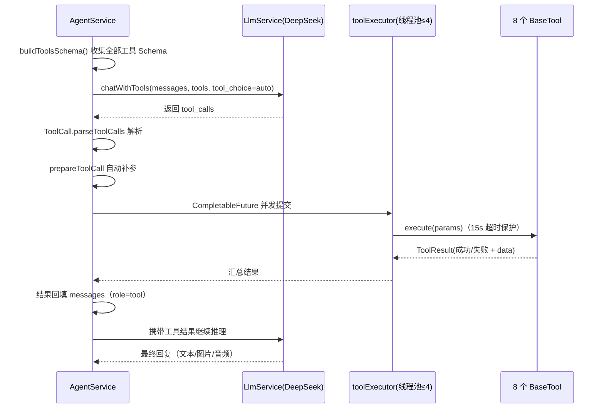
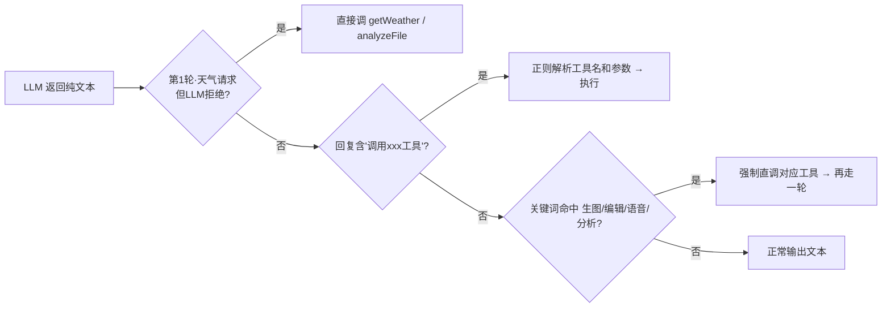

# Agent 工具调用体系

> 项目当前以 Web 端为主：**Spring AI @Tool 注解体系（68 个）**是线上主通路；**自研 BaseTool 体系（8 个）**作为自研 Agent 引擎的能力沉淀保留。

---

## 一、总览

| 维度 | 自研 BaseTool 体系 | Spring AI @Tool 体系 |
|---|---|---|
| 核心类 | `AgentService` + `BaseTool` | `ToolCallingService` + `@Tool` 注解 |
| 数量 | **8 个** | **68 个**（SpringAiTools 66 + WeatherService 2） |
| 注册方式 | 实现 `BaseTool`，Spring 自动注入 `List<BaseTool>` | 反射扫描 `@Tool` 注解方法 |
| Schema 来源 | 手写 `ToolDefinition` | 从方法参数自动生成 |
| 执行方式 | 并发执行 `execute(params)`（线程池 ≤4，15s 超时） | 反射 `method.invoke(...)` 并发执行 |
| 状态 | 保留引擎（微信时代主通路，无外部调用方） | **Web 主通路**（`/api/ai/chat-with-tools`） |

---

## 二、Spring AI @Tool 体系（Web 主通路）

### 2.1 反射注册

`ToolCallingService` 构造时扫描类中带 `@Tool` 注解的方法（`SpringAiTools` 66 个 + `WeatherService` 2 个 = 68 个）：

```java
for (Method method : toolObject.getClass().getDeclaredMethods()) {
    Tool toolAnnotation = method.getAnnotation(Tool.class);
    if (toolAnnotation != null) {
        toolRegistry.put(toolName, new ToolInfo(toolObject, method, toolAnnotation));
    }
}
```

示例：

```java
@Tool(name = "getWeather", description = "查询指定城市的实时天气信息")
public WeatherResponse getWeather(
        @ToolParam(description = "城市名称，如：北京、上海、杭州") String city) {
    return weatherService.getWeatherByCity(city);
}
```

### 2.2 执行特点

- **Schema 自动生成**：遍历方法参数，用 `@ToolParam` 的 description/required 生成 JSON Schema，不用手写
- **执行循环**：`ToolCallingService` 自研工具循环，最多 5 轮、`CompletableFuture` 并发、结果封装成 `ToolCallResult`（含耗时/成功标记）
- **调用报告**：返回带 `traceId`、迭代次数、token 用量的响应，前端可展示工具调用历史
- **白名单过滤**：`/api/ai/chat-with-tools` 可传 `allowedTools`，只放行指定工具

### 2.3 68 个工具清单（按域划分）

**通用能力（约 12 个）**：getCurrentTime、getWeather、webSearch、professionalSearch、synthesizeSpeech、generateImage、analyzeImage、editImage、analyzeFile、searchNearbyService 等

**护理域（约 14 个）**：createCareReminder、completeCareReminder、listCareReminders、queryPetCare、queryPlantSafety、queryFoodSafety、triageSymptoms、saveMedication、checkMedication、compareImages、generateCarePlan、weatherAlert、diagnoseDisease、queryWeather

**业务域（40+ 个）**：商城、库存、社区、时间线、简报、知识库、护理档案/记录等业务操作类工具

> 完整清单以运行时接口 `/api/ai/tools/registered` 返回为准。

---

## 三、自研 BaseTool 体系（保留引擎）

### 3.1 工具的定义

每个工具继承 `BaseTool`，实现四个抽象方法：

```java
public abstract class BaseTool {
    public abstract String getName();            // 工具名，如 getWeather
    public abstract String getDescription();     // 给 LLM 看的功能描述
    public abstract ToolDefinition getDefinition();  // 参数 Schema
    public abstract ToolResult<?> execute(JSONObject params);  // 真正执行
}
```

`ToolDefinition` 把参数拼成 OpenAI 格式的 JSON Schema（`type / function / parameters`），大模型据此知道每个工具接受什么参数。

### 3.2 注册与发现

`AgentService` 构造时注入 `List<BaseTool>`（Spring 自动收集所有 BaseTool 子类 Bean），逐个放入注册表：

```java
for (BaseTool tool : tools) {
    toolRegistry.put(tool.getName(), tool);   // Map<String, BaseTool>
}
```

**新增工具 = 新建一个类继承 BaseTool**，主流程零改动。

### 3.3 8 个 BaseTool

| 工具名 | 实现类 | 功能 |
|---|---|---|
| `getWeather` | WeatherTool | 心知天气查询 |
| `webSearch` | WebSearchTool | 百度联网搜索 |
| `generateImage` | ImageGenerationTool | qwen-image 文生图 |
| `editImage` | ImageEditTool | 图片编辑（换风格/改背景） |
| `analyzeImage` | ImageAnalysisTool | qwen-vl 图片分析 |
| `analyzeFile` | FileAnalysisTool | PDF/Word/TXT 解析与问答 |
| `synthesizeSpeech` | TtsTool | 讯飞 TTS 语音合成 |
| `searchNearbyService` | NearbyServiceTool | 高德附近宠物医院/园艺店等 |

### 3.4 一次工具调用的完整流程（AgentService）



关键细节：

- **并发执行**：同一轮多个工具并行（线程池最多 4），互不等待；单工具 15 秒超时，超时记失败不卡整体
- **自动补参**：`prepareToolCall` 补上下文参数——`editImage` / `analyzeImage` 自动带 `userId`；`analyzeFile` 自动从上传信息解析 `fileUrl` / `fileName`
- **结果回填**：工具结果以 `role=tool` + `tool_call_id` 追加回消息数组，LLM 下一轮可见并继续推理
- **特殊结果**：生图/编辑/语音成功后，文件路径记入 `lastImageRef` / `lastAudioRef`，最终回复可带图/带音
- **循环上限**：最多 5 轮，防止模型反复调工具死循环

### 3.5 三层兜底（LLM 没调工具时的保底）



---

## 四、两套体系对比

| 维度 | BaseTool（自研） | @Tool（Spring AI） |
|---|---|---|
| 工具数量 | 8 | 68 |
| 加工具成本 | 新建类继承 BaseTool | 新增一个带注解的方法 |
| 参数 Schema | 手写 ToolDefinition | 注解自动生成 |
| 自动补参 | ✅（userId / fileUrl 等） | ❌ 需在方法内处理 |
| 兜底机制 | ✅ 三层兜底 | 无（靠系统提示词约束） |
| 产物处理 | ✅ 图片/音频路径回传 | 一般文本返回 |
| 当前状态 | 保留引擎（无外部调用） | Web 线上主通路 |

---

## 五、为什么保留两套

- 自研 `BaseTool` + `AgentService` 是微信时代的 Agent 主通路，代码沉淀了完整的工具编排能力（自动补参、三层兜底、图文语音产物），为后续小程序/APP 复用
- Web 端走 Spring AI `@Tool`，注解 + 反射让"加工具 = 加方法"，开发效率高
- 两套共用 DeepSeek 模型与同一套业务服务（提醒、用药、天气等），**重复的只是协议层，不是业务逻辑**
