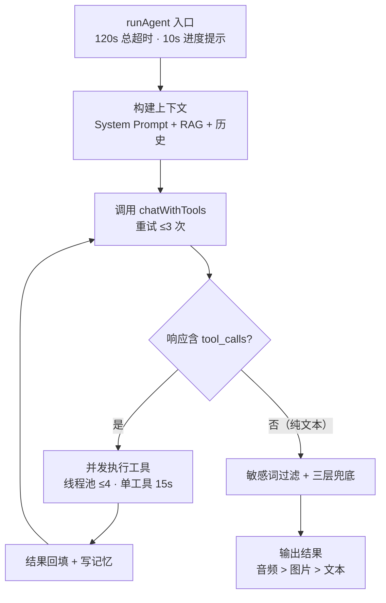
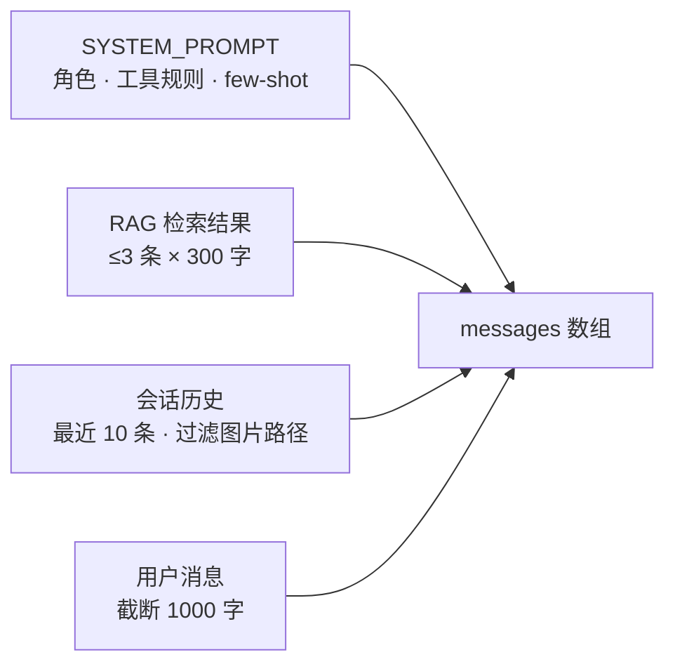
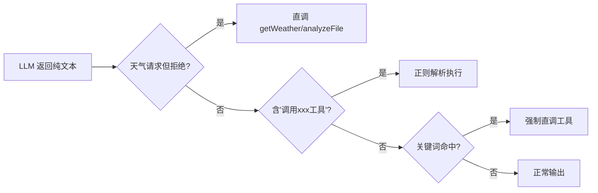

# Agent 核心能力设计介绍

> 本文介绍项目自研 Agent（`AgentService`）的核心能力设计：多轮推理循环、上下文构建、工具调用、记忆 RAG、可靠性保障与多模态处理。
>
> 状态说明：`AgentService` 为自研 Agent 引擎，曾是微信时代的对话主通路；微信接入移除后代码保留沉淀，Web 端对话主通路为 **Spring AI + `ToolCallingService`（68 个 @Tool）**。

---

## 一、设计目标

Agent 是平台的"技术心脏"，设计上追求四个目标：

1. **多模态输入统一**：文本、图片、语音、文件都能进入同一个推理循环
2. **工具化执行**：把天气、生图、识别、语音等能力抽象成工具，由模型按需编排
3. **可靠兜底**：模型"该调工具却没调"时，系统仍能给出可执行的结果
4. **记忆延续**：结合对话历史与 RAG，让模型"记得住"上下文

---

## 二、总体设计：多轮推理循环

核心循环最多 **5 轮**（`MAX_ITERATIONS`），防止模型反复调工具死循环；LLM 调用失败自动重试 3 次，连续失败 2 次即终止。

---

## 三、上下文构建

每次请求前，`buildContextMessages` 按顺序组装：

| 环节 | 说明 |
|---|---|
| 系统提示词 | 角色定义、安全规则、6 类工具触发规则、多工具 few-shot 示例 |
| RAG 注入 | 问题向量化 → 余弦相似度检索 → top5 → 截取前 3 条 × 300 字，拼入"# RAG知识库检索结果" |
| 会话历史 | 最近 10 条，过滤含图片路径/上传路径的记录 |
| 长度保护 | 总长超 8000 字符时从最旧截断；用户消息截断 1000 字 |

---

## 四、工具调用体系

### 4.1 工具注册

所有工具继承 `BaseTool`（`getName/getDescription/getDefinition/execute`），Spring 自动注入后进入 `toolRegistry`（`Map<String, BaseTool>`），每次对话把全部工具的 JSON Schema 发给模型（`tool_choice=auto`）。

自研引擎保留 **8 个 BaseTool**：天气、联网搜索、文生图、图片编辑、图片分析、文件分析、语音合成、附近服务。

> 完整工具调用体系（含 Web 端 68 个 @Tool、并发执行、自动补参、三层兜底）见《Agent工具调用体系.md》。

### 4.2 自动补参与特殊产物

- `editImage` / `analyzeImage` 自动补充 `userId`（会话上下文）
- `analyzeFile` 自动从上传信息解析 `fileUrl` / `fileName`
- 生图/编辑/语音成功后，产物路径记入 `lastImageRef` / `lastAudioRef`，最终回复可携带图片或语音

---

## 五、记忆与 RAG 集成

每轮对话结束调用 `saveMessagePair`，触发两条链路：

1. **写 MySQL 历史**（user + assistant）
2. **发布事件**：`VectorSaveEvent`（异步向量化入库）+ `SummaryUpdateEvent`（异步滚动摘要）

读取时，Agent 先做向量检索注入提示词，再带最近历史与系统提示词一起送模型，形成"**历史 + 摘要 + 向量检索**"三层记忆。

> 记忆与 RAG 的完整写入/读取时序见《项目介绍与记忆RAG系统设计.md》第五章。

---

## 六、可靠性设计

| 机制 | 设计值 | 作用 |
|---|---|---|
| 总超时 | 120s | 防止单次请求无限执行 |
| 迭代上限 | 5 轮 | 防止工具调用死循环 |
| LLM 重试 | ≤3 次 | 容忍瞬时网络/服务错误 |
| 工具并发 | 线程池 ≤4 | 多工具并行，缩短响应 |
| 单工具超时 | 15s | 单个工具卡死不阻塞整体 |
| 进度提示 | 10s | 长时间处理先告知用户"正在生成" |
| 敏感词过滤 | — | 回复内容安全过滤 |
| 三层兜底 | 直接调用 → 自然语言解析 → 关键词强制 | 模型漏调工具时保底 |
| 连续失败终止 | 2 次 | 快速失败，避免无效重试 |

### 三层兜底流程

---

## 七、多模态输入处理

> 下表为 `AgentService` 的通用处理能力（语音/文件为保留能力，Web 端当前以文字 + 图片输入为主）。

| 输入 | 预处理 | 进入 Agent 的内容 |
|---|---|---|
| 文本 | 检查会话待处理图片 | 原样或拼接图片上下文 |
| 图片 | qwen-vl 预识别 | `图片内容：{描述} + 用户问题` |
| 语音 | ffmpeg 转 WAV → DashScope ASR | 转出的文字 |
| 文件 | 保存 uploads + 解析 | `用户上传了文件：… + 用户问题` |

输出同样多形态：**文字、图片（生图/编辑产物）、语音（讯飞 TTS 合成）**，优先级 音频 > 图片 > 文本。

---

## 八、关键参数速查

| 参数 | 值 | 位置 |
|---|---|---|
| `MAX_ITERATIONS` | 5 | AgentService |
| `TIMEOUT_SECONDS` | 120 | AgentService |
| `TOOL_EXECUTION_TIMEOUT_SECONDS` | 15 | AgentService |
| `PROGRESS_NOTIFY_SECONDS` | 10 | AgentService |
| 工具线程池 | ≤ min(CPU, 4) | AgentService |
| `MAX_HISTORY_MESSAGES` | 10 | AgentService |
| `MAX_RAG_RESULTS` | 3 | AgentService |
| `MAX_RAG_RESULT_LENGTH` | 300 字 | AgentService |
| `MAX_CONTEXT_LENGTH` | 8000 字符 | AgentService |
| RAG top-k / 阈值 | 5 / 0.5 | application.properties |

---

## 九、设计权衡

1. **自研协议 vs Spring AI**：自研通路用 `LlmService` 直调 DeepSeek，换取自动补参、强制兜底、图文语音产物等深度定制；Web 端用 Spring AI 注解化，换取开发效率。
2. **事件异步写记忆**：向量入库、摘要生成异步执行，不阻塞回复，代价是记忆短暂延迟生效。
3. **内存向量索引**：全量加载、O(n) 线性检索，换来低延迟；知识库增长后需升级为索引方案。
4. **消息处理串行化**：单线程逐条处理（原微信场景），保证时序一致，但高并发下吞吐受限。

---

## 十、已知限制与演进方向

**已知限制**

- RAG 检索未按会话隔离（`searchSimilar` 忽略 conversationId）
- 向量索引全量驻留内存，检索为线性扫描
- `LlmService.chatWithMemory` 存在重复写向量的可能

**演进方向**

- ✅ SSE 流式输出（已实现）
- ✅ 知识库管理后台（已实现）
- 按会话隔离的 RAG 检索
- 工具调用成本与成功率可观测（trace 面板）
