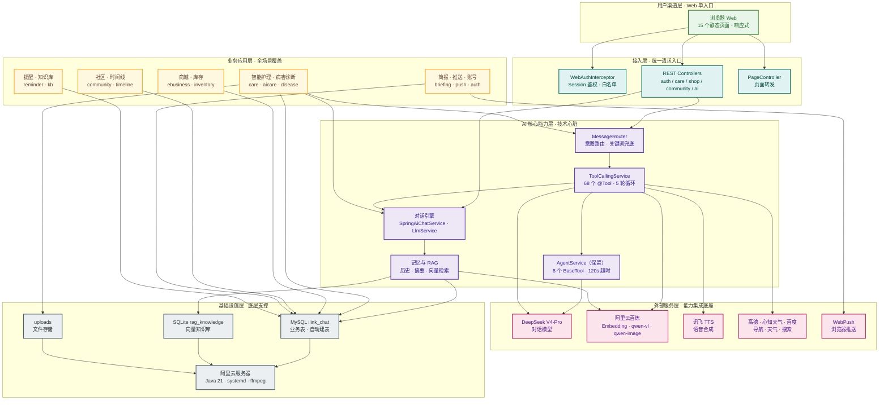

# 六层解耦架构总览（Web 版）

> 配套 PNG：`图片/架构图-六层解耦.png`（可放入 PPT）

## 各层说明

| 层 | 说明 |
|---|---|
| 用户渠道层 | 浏览器 Web 单入口，15 个静态页面覆盖登录注册、首页、对话、护理、病害、提醒、知识库、简报、商城、库存、社区、时间线，移动端响应式适配。 |
| 接入层 | WebAuthInterceptor 统一鉴权（`/api/**`、`/uploads/**` 需登录）+ REST Controllers + PageController 页面转发，实现请求统一预处理。 |
| 业务应用层 | 智能护理、病害诊断、商城、库存、社区、时间线、简报、推送、账号、提醒、知识库 10 余个业务模块，覆盖养护咨询到周边消费、社交分享全链路。 |
| AI 核心能力层 | SpringAiChatService 对话引擎 + ToolCallingService（68 个 @Tool）为主通路，AgentService（8 个 BaseTool）保留沉淀；意图路由、记忆与 RAG 检索构成智能调度中枢。 |
| 外部服务层 | 集成 DeepSeek V4-Pro、阿里云百炼、讯飞、高德、心知天气、百度、WebPush，按需调用大模型、视觉、生图、语音、天气、地图、搜索、推送等第三方能力。 |
| 基础设施层 | MySQL + SQLite 向量库双数据源，uploads 文件存储，阿里云服务器（Java 21 / systemd / ffmpeg）承载；启动自动建表，无需手工运维 SQL。 |
