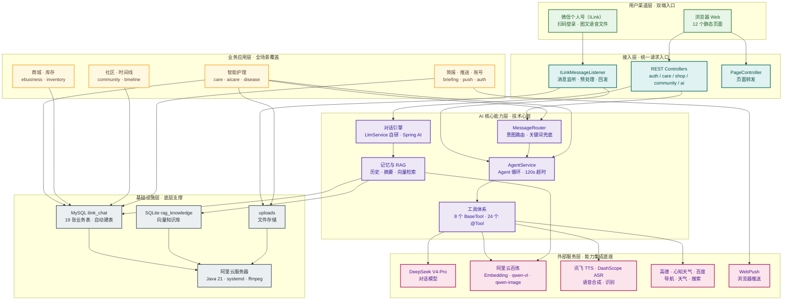

# 六层解耦架构总览（详细版）

> 配套 PNG：`架构图-六层解耦.png`（简化版，可放入 PPT）

## 各层说明（完整文字版）

| 层 | 说明 |
|---|---|
| 用户渠道层 | 打通微信个人号、浏览器 Web 双入口，两套前端共用同一套 AI 能力，既覆盖微信端轻量化场景，也满足 Web 端复杂功能操作需求。 |
| 接入层 | 提供 ILink 消息监听、REST API、页面服务三类接入能力，支持扫码登录、HTTP 接口调用、静态页面转发，实现不同渠道请求统一预处理。 |
| 业务应用层 | 包含智能护理、商城、库存、社区、时间线、简报、推送 7 个业务模块，覆盖用户从养护咨询到周边消费、社交分享的全链路需求。 |
| AI 核心能力层 | 自研 AgentService 搭配 Spring AI 双通路，实现 Agent 智能编排、多模态 AI 处理、记忆与 RAG 检索三大核心能力，是所有智能交互的调度中枢。 |
| 外部服务层 | 集成 DeepSeek V4-Pro、阿里云百炼、讯飞、高德、心知天气 5 类外部 API，按需调用大模型、语音识别、天气查询、地图导航等第三方能力，降低自研成本。 |
| 基础设施层 | 采用 MySQL + SQLite 向量库双数据源，搭载阿里云服务器部署，为全系统提供数据存储与算力支持；启动自动执行建表脚本，无需手工运维 SQL。 |
