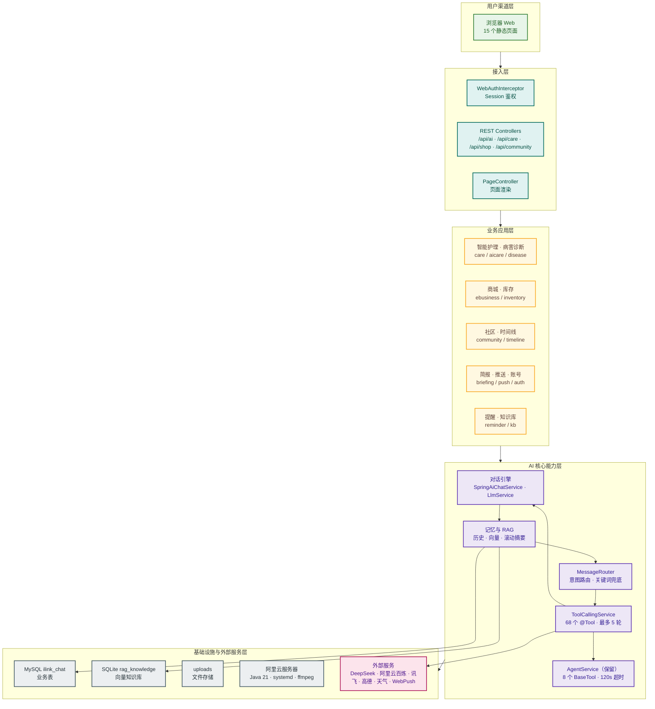

# 系统架构图（纵向 · 5 层 · Web 版）

## 连接逻辑说明

- 用户渠道层 → 接入层（鉴权拦截 → 路由分发）
- 接入层 → 业务应用层
- 业务应用层 → AI 核心能力层（护理问答、提醒、简报等调用 Agent 能力）
- AI 核心层内部交互：对话引擎 → 记忆与 RAG；MessageRouter → ToolCallingService；工具循环 → 对话引擎 / AgentService
- AI 核心层 → 外部服务（DeepSeek、阿里云百炼、讯飞、高德、天气、WebPush）
- 数据落库：记忆与 RAG → MySQL / SQLite；文件 → uploads
