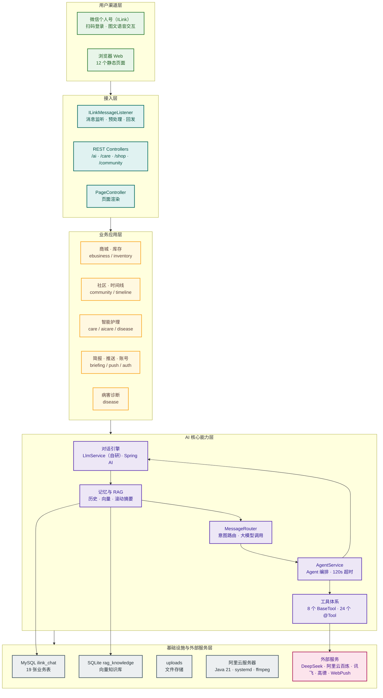

# 系统架构图（纵向 · 5 层）

## 连接逻辑说明

- 用户渠道层 → 接入层
- 接入层 → 业务应用层
- 业务应用层 → AI 核心能力层
- AI 核心层内部交互：对话引擎 → 记忆与 RAG；MessageRouter → AgentService；AgentService → 对话引擎 / 工具体系
- AI 核心层 → 外部服务（DeepSeek、阿里云百炼等）
- 数据落库：记忆与 RAG → MySQL / SQLite
