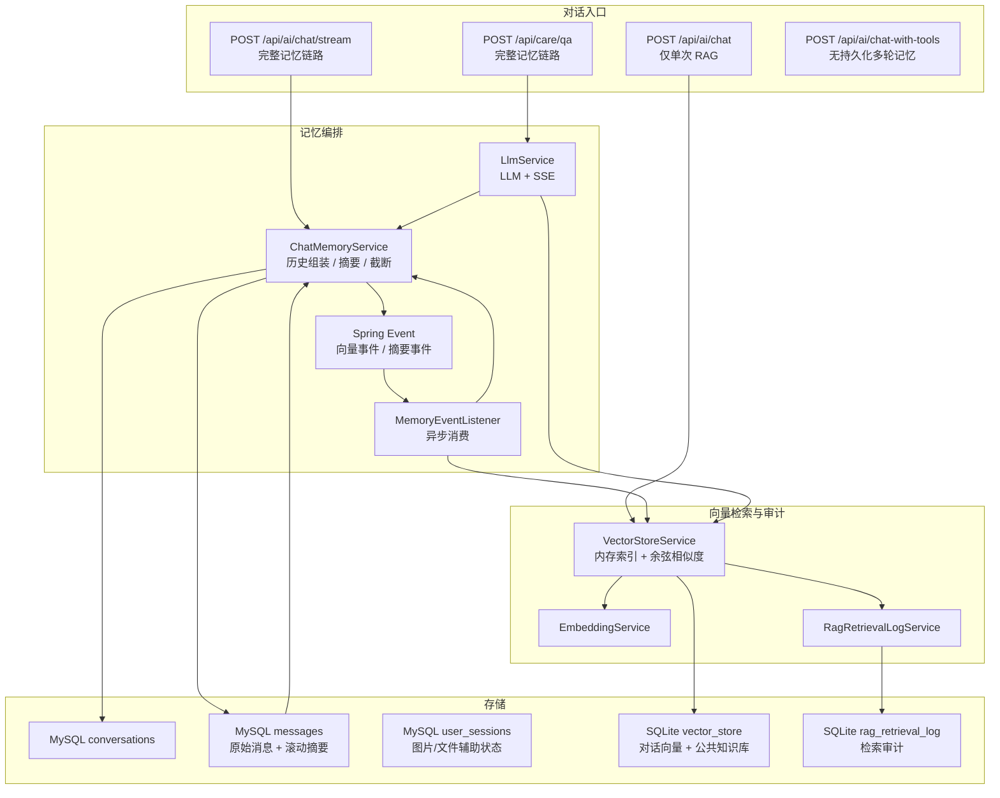
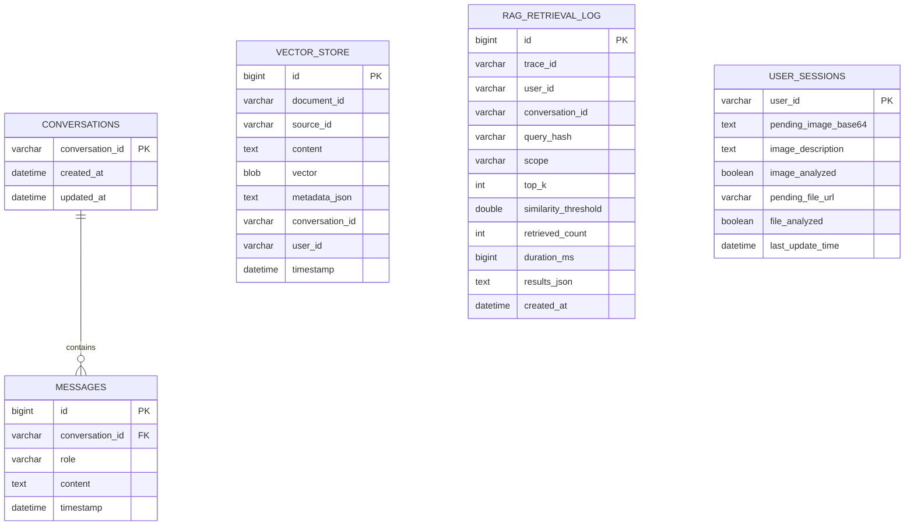
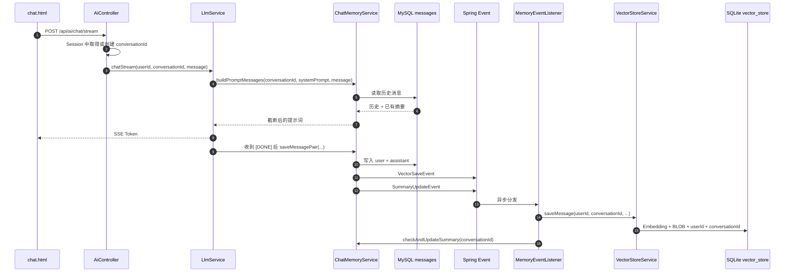
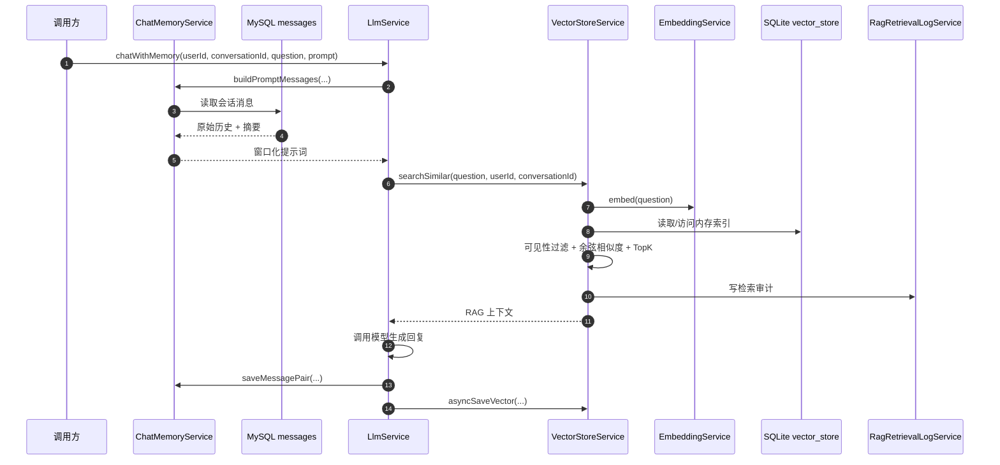

# Sekai PetPlant 记忆系统架构与现状审计

> 审计日期：2026-10-06
> 审计分支：`main`
> 审计基线：`b241bd1 feat(rag): add retrieval isolation and audit logging`
> 结论口径：以当前源码和实际运行为准，不采用 README 或设计文档中的推测性描述。

---

## 一、结论摘要

项目当前已经形成“四层记忆 + 一类辅助会话状态”的结构：

1. **MySQL 对话历史**：保存原始多轮消息，是短期记忆主载体。
2. **MySQL 滚动摘要**：超过阈值后，把旧对话压缩成 `【对话摘要】` 系统消息。
3. **SQLite 向量记忆**：保存对话轮次向量和公共知识库文档向量，是长期语义记忆与 RAG 检索载体。
4. **SQLite 检索审计**：记录每次 RAG 检索的范围、参数、命中文档标识和耗时，不保存查询明文与命中正文。

辅助状态为 `user_sessions`：它保存待处理图片、图片描述、待处理文件等跨消息状态，属于“会话状态”，不是语义记忆。

当前最重要的架构事实是：**只有部分对话入口真正读写多轮记忆**。`/api/ai/chat/stream` 和 `/api/care/qa` 是完整链路；`/api/ai/chat` 只做单次 RAG，不读取或保存 MySQL 对话历史；`/api/ai/chat-with-tools` 不接入持久化多轮记忆。

---

## 二、运行与验证结果

本次在真实工程上完成了以下验证：

| 项目 | 结果 |
|---|---|
| Maven 测试 | `mvn -B test`，37/37 通过，BUILD SUCCESS |
| Spring 上下文 | 完整启动成功 |
| MySQL | 连接正常；审计时 `conversations` 约 163 条，`messages` 约 1359 条 |
| SQLite 向量库 | 启动后加载约 236 条向量 |
| Web 冒烟 | `/`、`/login`、`/register`、`/home`、`/chat` 均 HTTP 200 |
| 鉴权冒烟 | 未登录访问 `/api/ai/tools/registered` 返回 HTTP 401 |

验证期间应用使用 18080 端口临时启动，审计完成后已经正常停止。

---

## 三、记忆相关文件全量清单

### 3.1 核心记忆服务

| 文件 | 职责 |
|---|---|
| `src/main/java/com/example/demo/chat/ChatMemoryService.java` | 对话历史读取、提示词组装、窗口截断、滚动摘要、消息对保存、通用清空 |
| `src/main/java/com/example/demo/chat/LlmService.java` | 流式/非流式 LLM 调用、带记忆问答、RAG 注入、对话向量直写 |
| `src/main/java/com/example/demo/chat/VectorStoreService.java` | 向量序列化、SQLite 向量写入、启动加载、余弦相似度检索、隔离、删除、审计触发 |
| `src/main/java/com/example/demo/chat/EmbeddingService.java` | 调用 Embedding 模型，把文本转换为向量 |
| `src/main/java/com/example/demo/chat/RagRetrievalLogService.java` | 写入 RAG 检索审计记录 |

### 3.2 存储仓库与实体

| 文件 | 职责 |
|---|---|
| `chat/repository/ChatMemoryRepository.java` | 对话记忆仓库接口 |
| `chat/repository/DatabaseChatMemoryRepository.java` | MySQL/JPA 实现，按 `conversationId` 读写消息 |
| `chat/repository/InMemoryChatMemoryRepository.java` | 内存实现，通常用于测试或降级 |
| `chat/repository/mysql/ConversationRepository.java` | 会话仓库 |
| `chat/repository/mysql/MessageRepository.java` | 消息仓库 |
| `chat/repository/sqlite/VectorStoreRepository.java` | 向量仓库 |
| `chat/repository/sqlite/RagRetrievalLogRepository.java` | 检索审计仓库 |
| `chat/entity/Conversation.java` | `conversations` 实体：只有会话 ID、创建/更新时间 |
| `chat/entity/Message.java` | `messages` 实体：只有 `conversation_id`、角色、正文、时间，没有 `user_id` |
| `chat/entity/sqlite/VectorStore.java` | `vector_store` 实体：含 `user_id`、`conversation_id`、`source_id`、BLOB 向量 |
| `chat/entity/sqlite/RagRetrievalLog.java` | `rag_retrieval_log` 实体：查询哈希、范围、TopK、阈值、命中数、耗时 |

### 3.3 事件、异步与配置

| 文件 | 职责 |
|---|---|
| `chat/event/VectorSaveEvent.java` | 对话结束后发布向量写入事件 |
| `chat/event/SummaryUpdateEvent.java` | 对话结束后发布摘要更新事件 |
| `chat/listener/MemoryEventListener.java` | 异步消费向量写入和摘要更新事件 |
| `chat/config/AsyncConfig.java` | `vectorTaskExecutor`、`summaryTaskExecutor` 线程池 |
| `chat/config/ChatMemoryConfig.java` | 选择具体 ChatMemoryRepository 实现 |
| `chat/config/ChatMemoryMigration.java` | 初始化或迁移记忆表结构 |
| `chat/config/SQLiteConfig.java` | SQLite 数据源配置 |

### 3.4 入口、调用者与前端

| 文件 | 记忆相关性 |
|---|---|
| `ai/AiController.java` | 创建/复用 Session 中的 `conversationId`；流式入口触发完整记忆链路 |
| `ai/SpringAiChatService.java` | 单次对话和工具对话；可按 `conversationId` 做 RAG，但不读写 MySQL 多轮历史 |
| `care/CareController.java` | `/api/care/qa` 使用会话 ID 调用 `chatWithMemory` |
| `router/MessageRouter.java` | 旧路由链路；文本分支按是否有会话走不同实现，文件问答会保存消息对 |
| `agent/AgentService.java` | 旧 Agent 引擎；组装 RAG + MySQL 历史，并在多个结果分支保存消息对 |
| `community/CommunityService.java` | 发帖时把帖子写入公共知识库向量 |
| `kb/KnowledgeBaseController.java` | 上传知识库文档，按 `sourceId` 删除公共向量 |
| `resources/static/chat.html` | 前端“清空会话”当前只清空 DOM，不调用后端清空接口 |
| `resources/application.properties` | 记忆窗口、摘要阈值、TopK、相似度阈值等配置 |

---

## 四、四层记忆架构

### 4.1 组件与数据流

### 4.2 存储关系

---

## 五、各层记忆的工作方式

### 5.1 MySQL 短期对话历史

- 写入对象：`conversations`、`messages`。
- 每条用户消息和助手回复分别写入一行。
- 读取按 `conversationId` 升序加载，再按窗口和 Token 数截断。
- 配置默认值：
  - `chat.memory.max-messages=10`
  - `chat.memory.max-tokens=2000`
  - `chat.memory.summary-threshold=3000`
  - `chat.memory.summary-keep-recent=5`
- 安全边界：MySQL 层没有 `user_id`。只要拿到同一个 `conversationId`，查询条件本身不会阻止读取。

### 5.2 滚动摘要

写入链路：

1. `saveMessagePair` 保存 user/assistant 两条消息。
2. 发布 `SummaryUpdateEvent`。
3. `MemoryEventListener` 异步调用 `checkAndUpdateSummary`。
4. 总 Token 超过 3000 且历史消息多于 `5 × 2 = 10` 条时，压缩较早消息。
5. 删除旧摘要，写入新的 `system` 消息，内容以 `【对话摘要】` 开头。

需要注意：

- 摘要保存在 `messages` 表中，与原始消息混用同一张表，以 `role=system` 区分。
- 生成摘要后**不会删除旧消息**，因此 MySQL 数据仍会持续增长。
- 读取提示词时，如果调用方已经传入了系统提示词，历史中的摘要系统消息会被跳过。这会削弱部分入口对滚动摘要的利用。

### 5.3 SQLite 长期向量记忆

向量类型：

| 类型 | `source_id` | `conversation_id` | 可见性 |
|---|---|---|---|
| 公共知识库 | 有值 | 空 | 所有用户可见 |
| 对话记忆 | 空 | 有值 | 必须同时匹配 `userId + conversationId` |

存储方式：

- Embedding 结果为 `float[]`。
- 使用 `ByteBuffer` 按 float32 序列化为 BLOB。
- 启动时 `findAll()` 全量加载到内存。
- 当前索引结构为 `Map<rowId, IndexEntry>` 和按 rowId 对齐的向量列表。

检索方式：

1. 对查询文本调用 Embedding。
2. 读取锁保护下遍历整个可见索引。
3. 计算余弦相似度。
4. 过滤低于默认阈值 `0.5` 的结果。
5. 降序排序并取默认 TopK `5`。

当前并没有真正使用 HNSW 索引；依赖可以存在，但实际检索仍是进程内全量线性扫描。

### 5.4 RAG 检索审计

每次检索都会尝试写入 `rag_retrieval_log`，字段包括：

- `traceId`
- `userId`
- `conversationId`
- SHA-256 查询哈希
- 检索范围：`public_only`、`conversation`、`mixed`、`none`
- `topK`
- 相似度阈值
- 命中数量
- 耗时
- 命中结果的 `documentId`、`sourceId`、`similarity`、`origin`

不会保存查询明文，也不会保存命中文档正文。审计构建或写入失败只记录告警，不打断检索主链路。

---

## 六、核心调用链

### 6.1 主对话流式写入链路

### 6.2 完整读取与 RAG 检索链路

最后一步存在重复写入：`saveMessagePair` 已经发布 `VectorSaveEvent`，`chatWithMemory` 又直接调用一次 `asyncSaveVector`。并且该调用属于自调用，Spring `@Async` 代理可能不会生效，可能同步执行。

---

## 七、入口级“记忆真值表”

| 入口 / 调用路径 | 读取 MySQL 多轮历史 | 读取滚动摘要 | RAG 检索 | 保存 MySQL 消息 | 保存对话向量 | 当前判断 |
|---|---:|---:|---:|---:|---:|---|
| `/api/ai/chat/stream` | 是 | 受系统提示词影响 | 否 | 是 | 是，事件异步 | 线上主链路，但此入口不直接注入 RAG |
| `/api/care/qa` | 是 | 受系统提示词影响 | 是 | 是 | 是，但重复写入 | 记忆最完整的非流式入口 |
| `/api/ai/chat` | 否 | 否 | 是，仅 `conversationId != null` | 否 | 否 | 无持久化多轮记忆 |
| `/api/ai/chat-with-tools` | 否 | 否 | 否 | 否 | 否 | 只有工具调用日志，不构成对话记忆 |
| `MessageRouter` 文本 + 有会话 | 否 | 否 | 是 | 否 | 否 | 只调用单次 Spring AI；异常回退到旧链路后才有完整记忆 |
| `MessageRouter` 文本 + 无会话 | 否 | 否 | 否 | 否 | 否 | 单次工具对话 |
| `MessageRouter.processFileQA` | 否 | 否 | 否 | 是 | 是，事件异步 | 保存文件问答结果，但本次回答不读取历史 |
| 旧 `AgentService` | 是 | 通过历史读取可见 | 是 | 分支内保存 | 是，事件异步 | 旧引擎保留链路，覆盖分支较多 |
| 社区发帖 | 否 | 否 | 否 | 否 | 公共 `sourceId=post_{id}` | 写入公共知识库 |
| 知识库上传 | 否 | 否 | 否 | 否 | 公共 `sourceId` | 写入公共知识库 |

---

## 八、已确认的问题与风险

### P0：隔离语义与文档不一致

README 和设计文档描述“对话记忆按 `userId + conversationId` 隔离”，但 MySQL 的 `conversations`、`messages` 没有 `user_id`，实际读取只按 `conversationId`。目前真正执行 `userId + conversationId` 双条件隔离的只有 SQLite 对话向量。

影响：

- 只要会话 ID 泄漏、被猜测或被错误复用，MySQL 历史没有第二道归属校验。
- “记忆隔离已完成”应精确描述为“向量记忆隔离已完成，原始消息表尚未完成用户归属隔离”。

### P1：同一条回复可能写入两份对话向量

`LlmService.chatWithMemory` 先调用 `saveMessagePair`，它发布 `VectorSaveEvent`；随后又直接调用 `asyncSaveVector`，而后者再次执行 `VectorStoreService.saveMessage`。

影响：

- SQLite 中同一轮对话可能重复。
- 检索容易被重复内容占位。
- Embedding 调用量、存储量和成本增加。

### P1：清空会话语义不完整

- `ChatMemoryService.clearConversation` 只清 MySQL/内存消息，不清 SQLite 对话向量。
- `VectorStoreService.clearConversationVectors` 已实现，但当前没有生产调用方。
- `chat.html` 的“清空会话”只改 DOM，不调用后端，也不轮换 `conversationId`。

结果是用户点击“清空会话”后，服务器仍可能把后续消息续写到原会话；旧向量也仍可被召回。

### P1：摘要可能被系统提示词遮蔽

`buildPromptMessages` 的逻辑是：

- 如果调用方传入系统提示词，它先占用了 system 位置。
- 后续遇到数据库里的摘要 system 消息时，代码直接跳过。

影响：

- 携带自定义系统提示词的入口可能拿不到滚动摘要。
- 长对话在窗口截断后可能丢失早期事实。

### P1：摘要不删旧消息，MySQL 持续增长

摘要只是新增一条 `system` 消息，旧 user/assistant 消息仍全部保留。数据库不会自动收敛，长期会导致：

- `messages` 表不断膨胀。
- 每次读取加载全量历史后再截断，读取和 Token 统计成本随会话增长。
- 运维备份和迁移成本上升。

### P2：当前检索是内存线性扫描

虽然工程中存在 `multi-vector-hnsw` 相关依赖或设计意图，实际 `VectorStoreService` 仍是：

- 启动全量加载。
- 内存 Map 保存。
- 每次逐条计算余弦相似度。

向量量级小的时候可用，但数据量上升后会出现启动时间、内存占用和检索延迟线性增长。

### P2：批量 Embedding 串行执行

`EmbeddingService.embedBatch` 当前逐条调用 Embedding，没有批处理或并发。知识库文档导入越大，导入耗时越明显。

### P2：社区删除帖子会留下孤儿向量

`CommunityService.deletePost` 没有调用 `vectorStoreService.clearDocumentVectors("post_" + id)`。帖子删了，但其公共知识库向量仍可能被检索到。

### P2：召回指标仍缺少公开数据入口

检索审计已经保存可计算 `Recall@K` 所需的大部分标识和相似度，但当前没有受控只读接口把“本轮正确答案命中了哪些文档”与评测题关联起来。因此当前不能可靠计算 `Recall@K`，也不应伪造该指标。

---

## 九、建议的修复顺序

### 第一批：先消除语义错误

1. 在 `conversations` 或单独的归属表中增加 `user_id`，并在 `DatabaseChatMemoryRepository` 查询时校验 `userId + conversationId`。
2. 删除 `chatWithMemory` 中重复的 `asyncSaveVector` 调用，保留 `saveMessagePair -> VectorSaveEvent` 这一条向量写入链。
3. 把“清空会话”改为原子操作：
   - 清 MySQL 消息；
   - 清 SQLite 对话向量；
   - 轮换 Session 中的 `conversationId`；
   - 前端调用后端接口后再清 DOM。
4. 明确合并策略：如果调用方已有系统提示词，应把摘要合并进同一个 system 消息，而不是丢弃。

### 第二批：控制数据成本

1. 摘要成功后归档或删除已压缩的旧消息。
2. 对对话向量增加去重键，例如 `conversation_id + document_id` 或消息对哈希。
3. 知识库和帖子删除时同步清理向量。
4. 给向量表增加一致的清理任务，处理历史孤儿数据。

### 第三批：提升检索能力

1. 接入真正的 HNSW 或 SQLite 向量扩展，替代全量线性扫描。
2. Embedding 批量接口改为真正批量请求。
3. 增加受控只读召回明细接口，建立评测题和命中 `documentId` 的映射。
4. 在此基础上计算 `Recall@K`，再调 TopK、阈值和分块策略。

---

## 十、一句话架构判断

这个项目的记忆能力已经不是“只把消息存数据库”，而是形成了“MySQL 原始历史 + 滚动摘要 + SQLite 向量召回 + 检索审计”的组合系统；当前最需要补的不是再增加一层，而是统一各入口的记忆语义、消除重复写入，并把“清空、隔离、摘要利用”这三件事做成真正一致的契约。
