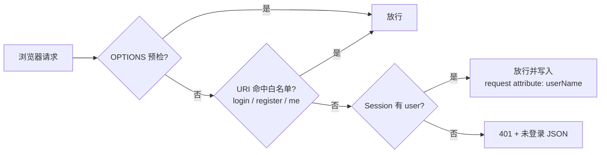
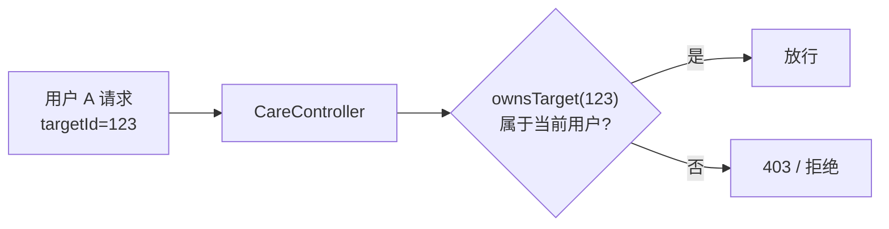

# 接口鉴权与安全设计

> 本文介绍 Web 端接口鉴权方案（Session + 拦截器）、数据隔离与密钥管理。

---

## 一、方案概述

采用 **HttpSession + WebMvc 拦截器**（方案 A）：

- 登录成功后在 `HttpSession` 写入用户标识
- `WebAuthInterceptor` 拦截 `/api/**` 与 `/uploads/**`
- 白名单请求直接放行，其余请求校验会话，未登录统一返回 **HTTP 401**

## 二、白名单与拦截范围

| 项 | 值 |
|---|---|
| 拦截路径 | `/api/**`、`/uploads/**` |
| 白名单 | `POST /api/auth/login`、`POST /api/auth/register`、`GET /api/auth/me`、`OPTIONS` 预检 |
| 未登录响应 | HTTP 401 + `{"code":500,"message":"未登录","data":null}` |
| 已登录传递 | `request.setAttribute("userName", user)`，Controller 直接复用 |

> 前端 `guard.js` / `common.js` 统一捕获 401 并跳转登录页。

## 三、数据隔离（越权防护）

多用户数据按 `user_id` 归属隔离：

- **档案**：`pet_profile`、`plant_profile` 均带 `user_id` 列，查询/修改按当前用户过滤
- **护理记录**：`CareController.getRecords / createRecord / qa` 增加 `ownsTarget()` 归属校验，只能操作属于自己的护理对象
- **提醒**：`care_reminder` 全部查询/更新带 `user_id` 条件（`AND user_id=?`）

## 四、密码与账号安全

- 密码使用 **BCrypt** 加盐哈希存储（`BCryptPasswordEncoder`）
- 注册时校验用户名唯一性；登录时 `matches` 比对
- 会话过期由容器管理，退出调用 `/api/auth/logout` 销毁 Session

## 五、密钥管理

| 位置 | 说明 |
|---|---|
| 本地 `application.properties` | 明文密钥，便于本地运行（**不推仓库**） |
| GitHub 仓库版本 | 占位符 `${ENV_VAR}`，真实密钥不落库 |
| `application-local.properties` | gitignored，本地与服务器（`/opt/ilink/`）各一份 |
| WebPush | 公钥在前端 JS，私钥仅存服务端配置 |

## 六、安全加固建议（待办）

- 接口限流（防刷）
- 上传文件类型白名单 + 大小/内容校验
- 密码强度校验、登录失败锁定
- 操作审计日志（谁在什么时间做了什么）
- Git 历史密钥清理与轮换
