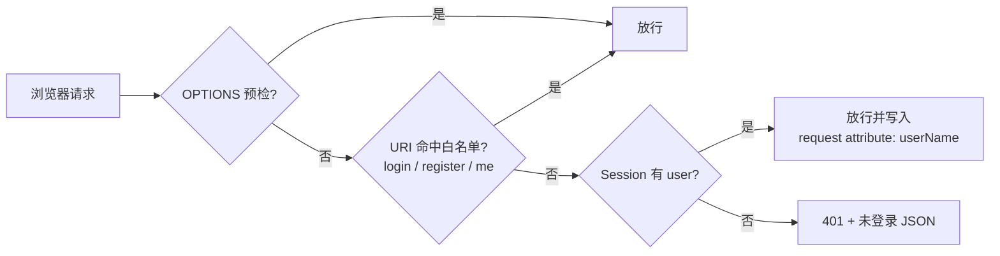
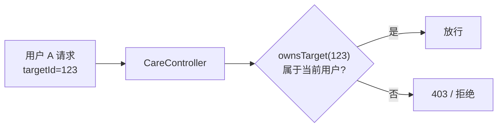

# 接口鉴权与安全设计

> 本文介绍 Web 端接口鉴权方案（Session + 拦截器）、数据隔离与密钥管理。

---

## 一、方案概述

采用 **HttpSession + WebMvc 拦截器**（方案 A）：

- 登录成功后在 `HttpSession` 写入用户标识
- `WebAuthInterceptor` 拦截 `/api/**` 与 `/uploads/**`
- 白名单请求直接放行，其余请求校验会话，未登录统一返回 **HTTP 401**

```mermaid
flowchart LR
    A["浏览器请求"] --> B{"OPTIONS 预检?"}
    B -- "是" --> Z["放行"]
    B -- "否" --> C{"URI 命中白名单?<br/>login / register / me"}
    C -- "是" --> Z
    C -- "否" --> D{"Session 有 user?"}
    D -- "是" --> E["放行并写入<br/>request attribute: userName"]
    D -- "否" --> F["401 + 未登录 JSON"]
```

## 二、白名单与拦截范围

| 项 | 值 |
|---|---|
| 拦截路径 | `/api/**`、`/uploads/**` |
| 白名单 | `POST /api/auth/login`、`POST /api/auth/register`、`GET /api/auth/me`、`OPTIONS` 预检 |
| 未登录响应 | HTTP 401 + `{"code":401,"message":"未登录","data":null}`，并设置 `Cache-Control: no-store` |
| 已登录传递 | `request.setAttribute("userName", user)`，Controller 直接复用 |

> 前端 `guard.js` / `common.js` 统一捕获 401 并跳转登录页。

## 三、数据隔离（越权防护）

多用户数据按 `user_id` 归属隔离：

- **档案**：`pet_profile`、`plant_profile` 均带 `user_id` 列，查询/修改按当前用户过滤
- **护理记录**：`CareController.getRecords / createRecord / qa` 增加 `ownsTarget()` 归属校验，只能操作属于自己的护理对象
- **提醒**：`care_reminder` 全部查询/更新带 `user_id` 条件（`AND user_id=?`）

```mermaid
flowchart LR
    U["用户 A 请求<br/>targetId=123"] --> C["CareController"]
    C --> O{"ownsTarget(123)<br/>属于当前用户?"}
    O -- "是" --> P["放行"]
    O -- "否" --> F["403 / 拒绝"]
```

## 四、密码与账号安全

- 密码使用 **BCrypt** 加盐哈希存储（`BCryptPasswordEncoder`）
- 注册时校验用户名唯一性，并校验用户名、密码、邮箱和手机号格式
- 登录时 `matches` 比对，按 IP + 用户名记录失败次数，15 分钟窗口内最多 5 次
- 会话过期由容器管理，退出调用 `/api/auth/logout` 销毁 Session
- Cookie 使用 `HttpOnly`、`SameSite=Lax`，生产环境应开启 `Secure`

## 五、密钥管理

| 位置 | 说明 |
|---|---|
| 仓库内 `application.properties` | 全部使用 `${ENV_VAR}` 占位，不保存真实密钥 |
| `application-local.properties` | gitignored，本地与服务器（`/opt/ilink/`）各一份 |
| WebPush | 公钥在前端 JS，私钥仅存服务端配置 |

## 六、请求与上传防护

- CORS 只允许显式白名单来源，不允许 `*`，允许携带 Session Cookie。
- 非安全 API 请求校验 `Origin` / `Referer`，作为 Session 的跨站请求防线。
- 单个上传文件上限为 10MB。
- 图片、文本、PDF、DOCX 和音频上传同时校验扩展名与文件内容。
- 文本文件拒绝 NUL 字节和非 UTF-8 内容。
- DOCX 校验 ZIP 结构和解压大小，避免把任意 ZIP 当作文档处理。
- 服务端使用 UUID 生成图片文件名，原始文件名不进入物理路径。

## 七、安全加固建议（待办）

- 全局限流与接口反滥用
- 操作审计日志（谁在什么时间做了什么）
- Git 历史密钥清理与轮换
- 依赖漏洞扫描和生产环境定期升级
