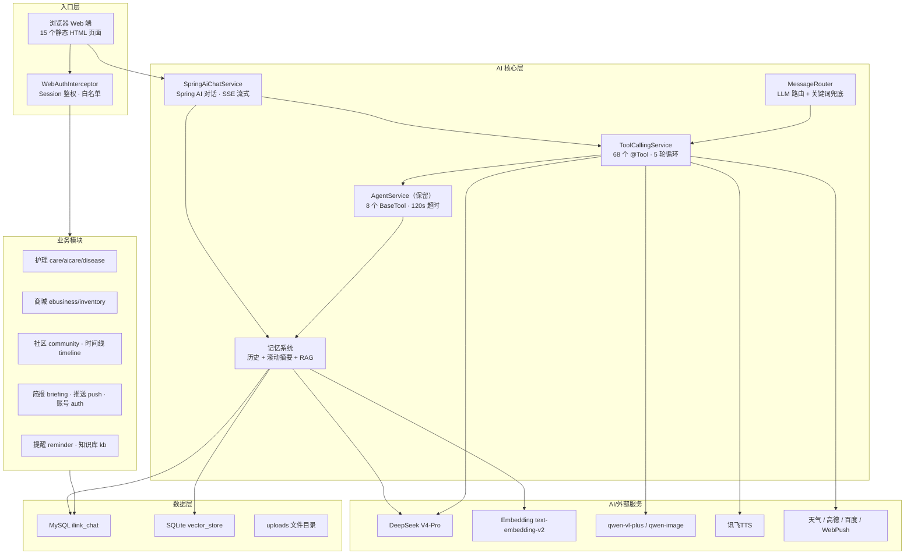
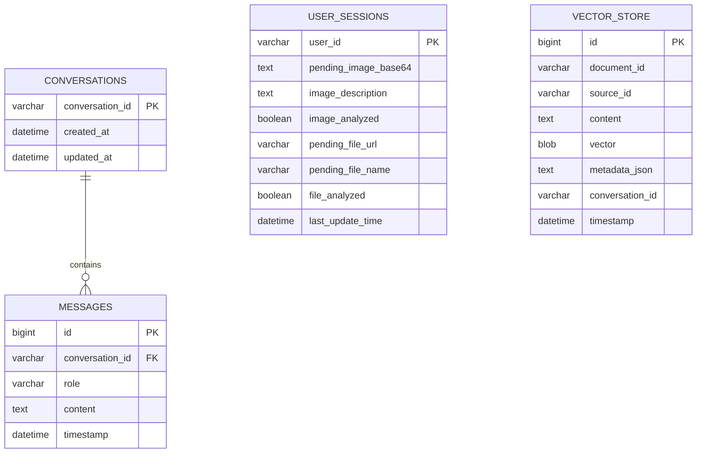
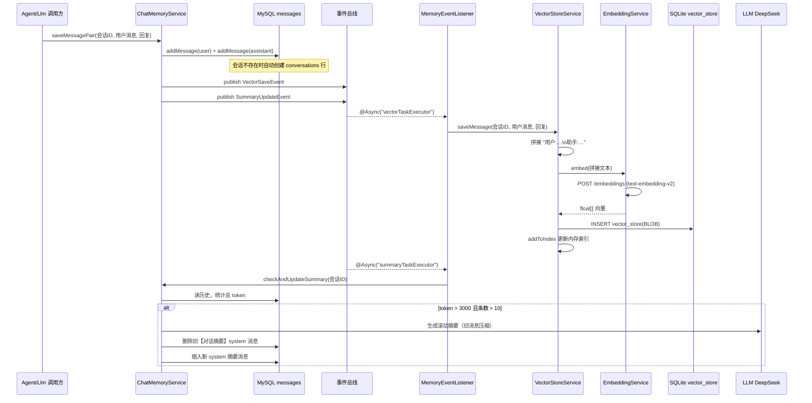
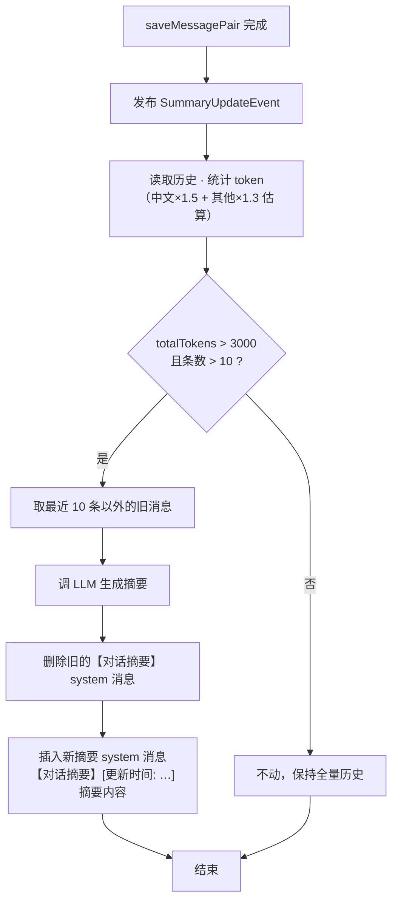
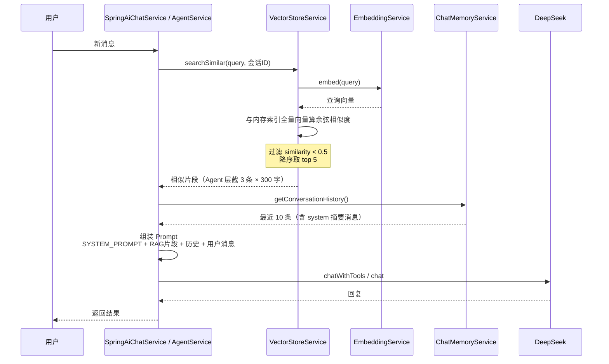
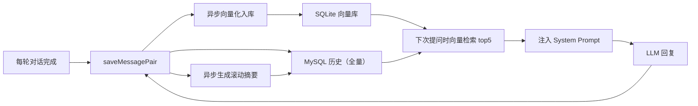

# Sekai PetPlant AI 护理平台

## 项目介绍与记忆 / RAG 系统设计

---

## 一、项目概览

一个以 **AI Agent 为核心**、面向**宠物与绿植护理场景**的 Web 平台。用户在浏览器端用文字、图片与 AI 对话：识别宠物/植物、评估健康、护理问答、提醒用药浇水、查天气、生图、搜索附近宠物医院；同时配套商城、库存、社区、时间线、简报、知识库等业务功能。

| 维度 | 内容 |
|---|---|
| 语言 / 框架 | Java 21 · Spring Boot 3.5.14 · Spring AI |
| 工程形态 | 单模块 Maven（`com.example.demo`，141 个 Java 文件） |
| 数据存储 | MySQL（主业务库 `ilink_chat`）+ SQLite（RAG 向量库 `rag_knowledge.sqlite`） |
| 对话模型 | DeepSeek V4-Pro（OpenAI 兼容接口） |
| 多模态模型 | qwen-vl-plus（视觉）、qwen-image-2.0（生图）、讯飞 TTS、DashScope ASR（语音输入） |
| 外部服务 | 心知天气、高德地图、百度搜索、WebPush |
| 入口 | 浏览器 Web（17 个静态页面） |
| 部署 | 阿里云轻量服务器（101.37.254.73:8080），systemd 托管 |

> 微信 ILink / 公众号接入已于 2026-08-15 移除，项目为纯 Web 端。

---

## 二、总体架构

---

## 三、入口层（Web）

### 1. 页面路由

`PageController` 转发 17 个静态页面：`/`（落地页）、`/login`、`/register`、`/home`、`/chat`、`/care`、`/disease`、`/reminders`、`/briefing`、`/kb`、`/stats`、`/gallery`、`/shop`、`/shop-publish`、`/community`、`/inventory`、`/timeline`。

### 2. 接口鉴权

`WebAuthInterceptor` 拦截 `/api/**` 与 `/uploads/**`：

- 白名单：`/api/auth/login`、`/api/auth/register`、`/api/auth/me`、OPTIONS 预检
- 未登录统一返回 401 + `{"code":500,"message":"未登录"}`
- 登录态存入 `HttpSession`，拦截器将 `userName` 放入 request attribute 供 Controller 复用

### 3. 数据隔离

宠物/植物档案（`pet_profile` / `plant_profile`）均带 `user_id`；护理记录、提醒等按用户归属校验（`ownsTarget`），接口层防止越权。

---

## 四、AI 核心层

### 1. Web 对话主通路（Spring AI）

- `SpringAiChatService`：Spring AI `ChatModel`（DeepSeek V4-Pro）+ 系统提示词（意图路由规则）+ RAG 向量检索注入 + 工具调用
- 流式：`POST /api/ai/chat/stream`（SseEmitter，前端打字机效果）
- 工具循环：`ToolCallingService` 自研循环（最多 5 轮、并发执行、结果回填），反射注册 **68 个 @Tool**（SpringAiTools 66 + WeatherService 2）

### 2. 自研 Agent 引擎（AgentService，保留）

`AgentService` 是项目自研的 Agent 循环引擎（约 60KB），曾作为微信时代主通路，现保留沉淀：

- **入口 `runAgent`**：120 秒总超时；10 秒未完成通过 `ProgressCallback` 发进度提示
- **上下文组装 `buildContextMessages`**：SYSTEM_PROMPT → RAG 检索结果（≤3 条 × 300 字）→ 会话历史最近 10 条（过滤图片路径）→ 8000 字符截断 → 用户消息（截 1000 字）
- **工具循环 `executeAgentLoop`**（≤5 轮）：`chatWithTools`（tool_choice=auto，失败重试 3 次）→ 并发执行工具（线程池 ≤4、单工具 15s 超时）→ 结果回填 → 继续推理
- **三层兜底**：LLM 未调工具时，依次尝试直接调用 → 自然语言工具解析 → 关键词强制调用
- **多形态输出**：文字、图片（生图/编辑产物）、语音（讯飞 TTS），优先级 音频 > 图片 > 文本

### 3. 工具体系（两套并行）

| 维度 | BaseTool（自研） | @Tool（Spring AI） |
|---|---|---|
| 数量 | 8 个 | 68 个 |
| 注册 | 实现 `BaseTool` + Spring 注入 | 反射扫描 `@Tool` 注解 |
| 状态 | 保留引擎 | Web 线上主通路 |
| 护理域覆盖 | 少（通用 8 个） | 全（护理域 14 个 + 业务域 40+） |

> 详见《Agent工具调用体系.md》与《Agent核心能力设计介绍.md》。

### 4. 双对话通路

| 通路 | 使用方 | 实现 |
|---|---|---|
| Spring AI `ChatModel` | Web `/api/ai/chat`、`/chat/stream` | Spring AI OpenAI 兼容客户端 |
| 自研 `LlmService` | `ToolCallingService` 工具循环、`AgentService` | fastjson2 + HttpClient5 直调 DeepSeek，JSON 工具调用 |

两者共享同一个向量库与 `ChatMemoryService`。

---

## 五、记忆与 RAG 系统（重点）

### 5.1 总体设计：三层记忆

| 层 | 载体 | 内容 | 生命周期 |
|---|---|---|---|
| 短期记忆（对话历史） | MySQL `messages` 表 | 每轮 user/assistant 两条全量消息 | 随会话持续增长，读取时截断 |
| 滚动摘要 | MySQL `messages` 表（role=system） | LLM 压缩后的历史要点（`【对话摘要】` 前缀） | 超过阈值时自动生成/替换 |
| 长期语义记忆（RAG） | SQLite `vector_store` 表 | 对话向量 + 原文 + 知识库文档分块 | 写入即永久，可按会话/来源删除 |
| 会话状态 | MySQL `user_sessions` 表 | 待处理图片 Base64、图片描述、待处理文件等 | 跨消息的短期状态 |

### 5.2 数据存储设计（ER 图）

### 5.3 向量数据格式与内存索引

- **存储格式**：`vector` 列是 BLOB，内容为 float32 数组的二进制序列化（每个浮点 4 字节，`ByteBuffer` 顺序写入）
- **内存索引**：`VectorStoreService` 启动时 `findAll()` 全量加载到进程内：
  - `vectorIndex: List<float[]>`（按下表 id 对齐）
  - `indexToContent: Map<rowId, 原文>`
- **检索算法**：余弦相似度线性扫描，阈值 0.5，取 top 5（`chat.vectorstore.top-k`）

### 5.4 写入链路（完整时序）

每轮对话结束都会触发：**MySQL 全量历史 + 异步向量入库 + 异步摘要更新**。

### 5.5 滚动摘要机制（决策流程）

### 5.6 读取与检索链路（完整时序）

### 5.7 记忆闭环总览

### 5.8 知识库后台（KB）

`/kb` 页面 + `/api/kb/*` 接口：

- **上传**：`POST /api/kb/upload` → 文件解析（PDF/Word/TXT）→ 按 500 字分块 → 每块 `saveDocument(sourceId, chunk, meta)` 向量化入库，`sourceId = kb_时间戳_文件名`
- **列表**：`GET /api/kb/list`（按来源聚合展示）
- **删除**：`DELETE /api/kb/{sourceId}` 按来源清理全部向量
- **检索复用**：入库后对话的 RAG 检索自动覆盖知识库内容

### 5.9 关键配置参数

| 配置 | 默认值 | 作用 |
|---|---|---|
| `chat.memory.max-messages` | 10 | 请求里最多携带的历史消息条数 |
| `chat.memory.max-tokens` | 2000 | 历史总 token 上限，超出丢最旧 |
| `chat.memory.summary-threshold` | 3000 | 超过后触发 LLM 滚动摘要 |
| `chat.memory.summary-keep-recent` | 5 | 摘要保留的最近轮数（×2 = 10 条） |
| `chat.vectorstore.top-k` | 5 | 相似检索返回条数 |
| `chat.vectorstore.similarity-threshold` | 0.5 | 余弦相似度门槛 |
| `chat.vectorstore.enabled` | true | ⚠️ 死配置，代码中未读取 |

### 5.10 设计注意事项（已知细节 / 待改进点）

1. **RAG 检索未按会话隔离**：`searchSimilar(query, conversationId)` 中 `conversationId` 参数在内存索引路径上被忽略，实际是全库检索（`searchSimilarWithMetadata` 才会按会话过滤）
2. **向量全量驻留内存 + 线性扫描**：知识库增长后启动变慢、检索 O(n)
3. **可能重复写入向量**：`LlmService.chatWithMemory` 既通过 `saveMessagePair` 触发事件写向量，又直接调用 `asyncSaveVector`，同一轮对话可能入库两次
4. **Embedding HTTP 连接不复用**：`EmbeddingService` 每次调用新建 `CloseableHttpClient`
5. **图片 Base64 存 MySQL**：`user_sessions.pending_image_base64` 大字段，建议改存文件路径
6. **摘要消息参与历史截断**：`【对话摘要】` system 消息存在 messages 表，读取时会随历史一起取出

---

## 六、业务模块与接口总览

### 护理域（项目重点）

| 接口 | 功能 | 数据表 |
|---|---|---|
| `POST /api/pet/recognize`、`/api/plant/recognize` | 上传照片 → qwen-vl 识别 → LLM 健康评估 → 存档案 | pet_profile / plant_profile |
| `POST /api/care/identify` | 通用识别 + 历史记录 | identify_history |
| `GET/POST/DELETE /api/care/targets/{type}` | 护理对象增删查（按用户隔离） | care_targets |
| `GET/POST /api/care/records` | 喂药/浇水等护理记录（归属校验） | care_records |
| `POST /api/care/qa` | 护理问答（RAG + LLM） | — |
| `POST /api/disease/diagnose` | 病害诊断 | disease 相关 |
| `/api/ai/care/reminder*` | 提醒创建/查询/完成（DAILY/WEEKLY/MONTHLY） | care_reminder |

### 生活业务域

| 模块 | 接口 | 功能 |
|---|---|---|
| 社区 | `/api/community/posts`、`/{id}/comments`、`/{id}/like`、`/tags` | 帖子/评论/点赞/标签 |
| 商城 | `/api/shop/publish`、`/list`、`/detail/{id}`、`/stats`；`/api/shop/category/*` | 商品发布/浏览/统计、分类 |
| 库存 | `/api/inventory/items`、`/items/{id}/consume`、`/alerts` | 库存 CRUD、消耗、低库存提醒 |
| 时间线 | `/api/timeline/{type}/{id}`、`/entry`、`/entry/{id}/annotate`、`/milestone/auto` | 照片/里程碑记录、AI 自动识别 |
| 简报 | `/api/briefing/generate` | 天气+护理提醒+LLM 日报（每天 8 点自动 + WebPush） |
| 推送 | `/api/push/subscribe`、`/test` | WebPush 订阅/测试推送 |
| 文件 | `/api/file/process`、`/api/file/qa` | 文件解析与问答 |
| 知识库 | `/api/kb/upload`、`/list`、`/{sourceId}` | 文档上传/列表/删除 |
| 账号 | `/api/auth/register`、`/login`、`/logout`、`/me` | 注册登录（BCrypt + HttpSession） |
| 对话 | `/api/ai/chat`、`/chat/stream`、`/chat-with-tools`、`/tools/registered` | 对话/流式/工具/工具清单 |
| 数据观测 | `/api/stats/overview`、`/tool-ranking`、`/trend` | 平台概览 / 工具调用排行 / 近 7 天趋势 |
| 语音 | `POST /api/asr/transcribe` | 浏览器录音转文字（ffmpeg → DashScope ASR） |
| 图片中心 | `GET /api/gallery/list`、`DELETE /api/gallery/{id}` | 媒体资产列表/删除 |

---

## 七、数据库总览

| 领域 | 表 |
|---|---|
| 账号 | users、user_sessions |
| 对话记忆 | conversations、messages |
| 护理 | care_targets、care_records、identify_history、pet_profile、plant_profile、care_reminder |
| 商城 | categories、products |
| 库存 | inventory_items |
| 社区 | community_posts、community_comments、community_likes |
| 时间线 | timeline_entries |
| 推送 | push_subscriptions |
| 数据观测 | tool_call_logs（原生 SQL，工具调用埋点） |
| 媒体资产 | media_assets（原生 SQL，图片中心） |
| RAG 向量库（SQLite） | vector_store（content + BLOB 向量 + metadata_json） |

> `care_reminder`、`identify_history` 由 `CareSchemaInitializer` 启动时自动建表；业务表由 Hibernate `ddl-auto=update` 维护。

---

## 八、前端

`src/main/resources/static` 下 17 个静态页面，无前端构建工具，直接 fetch REST API：

落地页（index）· 登录注册（login/register）· 首页（home）· 聊天（chat）· 护理（care）· 病害（disease）· 提醒（reminders）· 简报（briefing）· 知识库（kb）· 数据概览（stats）· 图片中心（gallery）· 商城（shop + shop-publish）· 社区（community）· 库存（inventory）· 时间线（timeline）

JS：`common.js` / `guard.js`（登录态与鉴权守卫）、`push.js`（WebPush 订阅）、`service-worker.js`（推送接收）。

---

## 九、启动与配置

- 对话 `deepseek-v4-pro`、Embedding `text-embedding-v2`、视觉 `qwen-vl-plus`、生图 `qwen-image-2.0`、TTS 讯飞 xiaoyan
- 记忆参数与向量参数见 5.9 节
- 上传限制 10MB，静态资源 `classpath:/static/, file:./uploads/`

**启动步骤**：

1. 启动 MySQL 并创建数据库 `ilink_chat`（账号密码见本地 `application-local.properties`，Hibernate 自动建表）
2. 确保 ffmpeg 在 PATH（文件/音频处理，可选）
3. 从项目根目录 `mvn spring-boot:run` 或 `./mvnw spring-boot:run`
4. 访问 `http://localhost:8080`，注册账号后即可使用

**服务器部署**：`mvn -B clean package -DskipTests` 打包后替换 `/opt/ilink/demo-0.0.1-SNAPSHOT.jar`，`systemctl restart ilink`；密钥放 `/opt/ilink/application-local.properties`。
