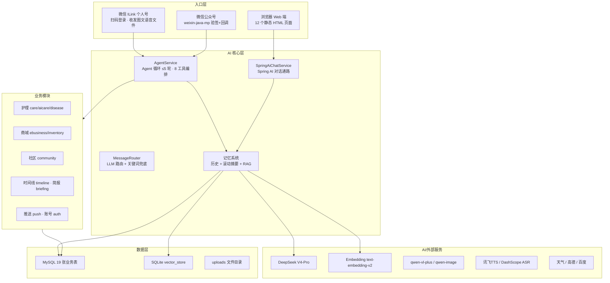
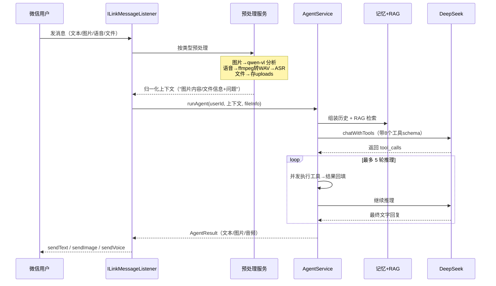
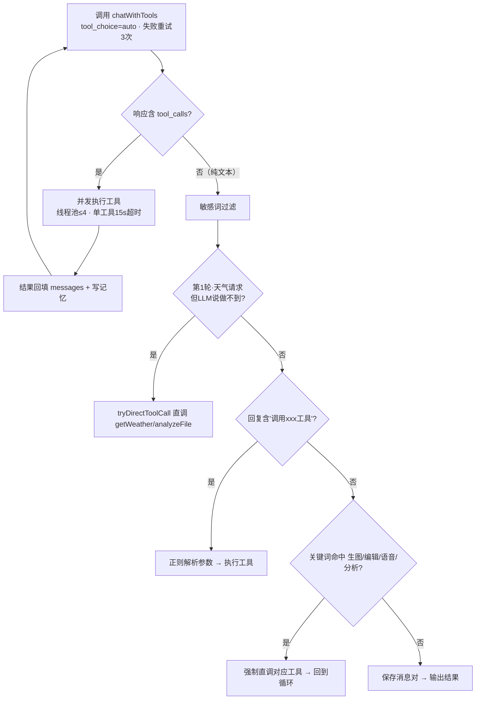
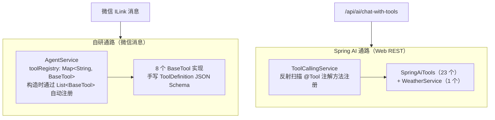
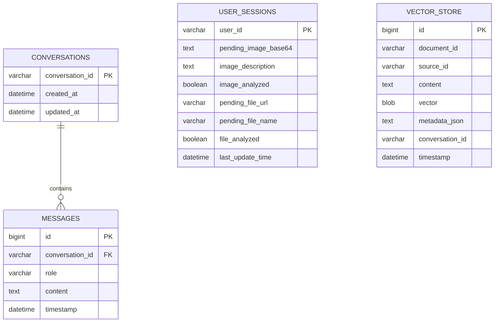
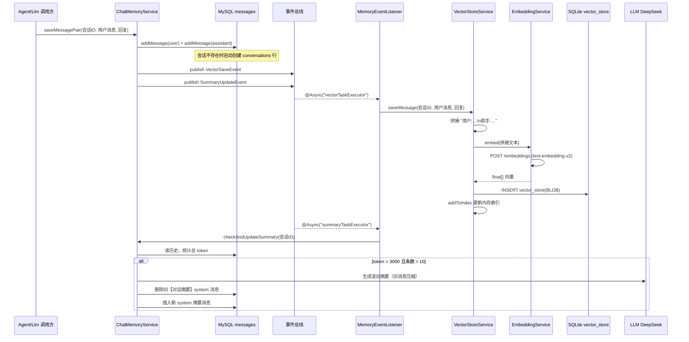
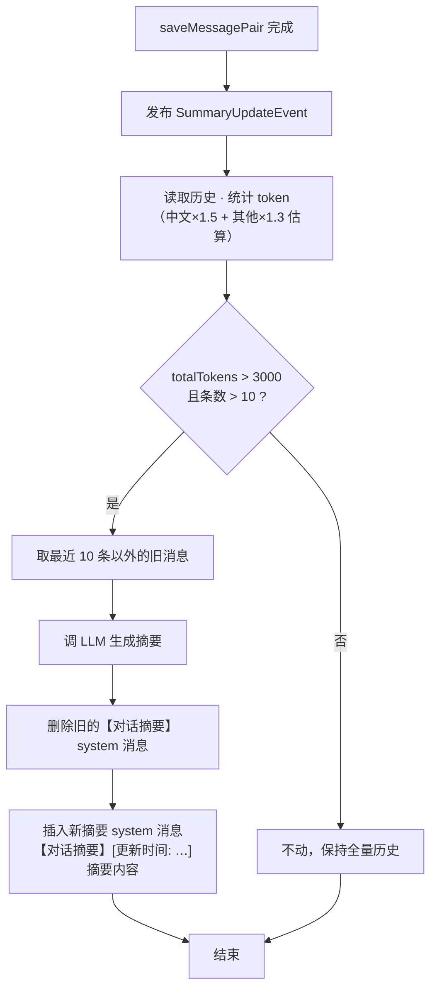
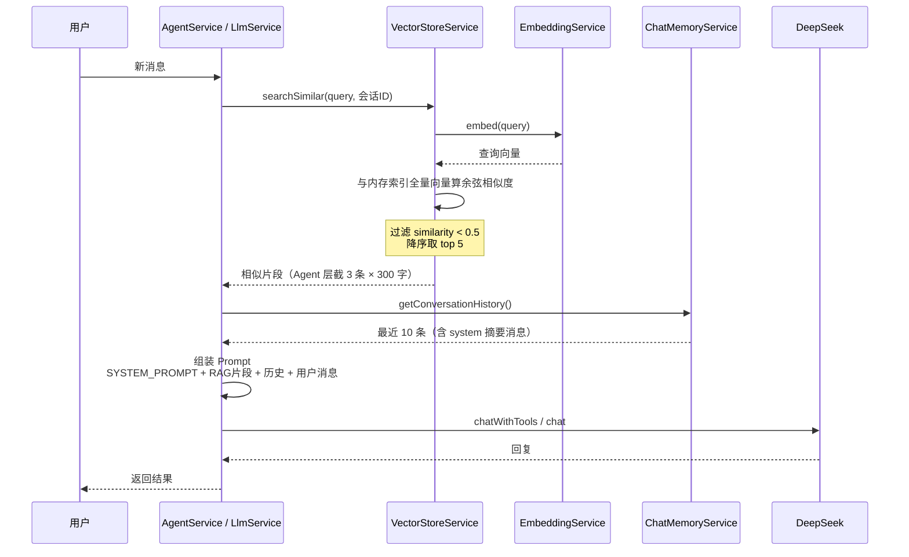
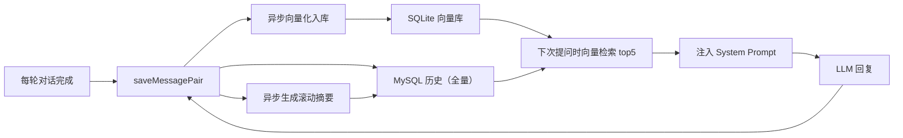

# 微信 ILink × AI 智能助手平台（宠物/绿植护理）

## 项目介绍与记忆 / RAG 系统设计

---

## 一、项目概览

一个以**微信聊天机器人为主入口**、面向**宠物与绿植护理场景**的 AI 智能助手平台。用户扫码登录微信个人号后，可以用文字、图片、语音、文件与 AI 对话：识别宠物/植物、评估健康、提醒用药浇水、查天气、生成图片、朗读回复；同时配套浏览器端的商城、社区、库存、时间线等 Web 功能。

| 维度 | 内容 |
|---|---|
| 语言 / 框架 | Java 21 · Spring Boot 3.5.14 · Spring AI 1.0.9 |
| 工程形态 | 单模块 Maven（`com.example.demo`，143 个 Java 文件） |
| 数据存储 | MySQL（主业务库 `ilink_chat`）+ SQLite（RAG 向量库 `rag_knowledge.sqlite`） |
| 对话模型 | DeepSeek V4-Pro（OpenAI 兼容接口） |
| 多模态模型 | qwen-vl-plus（视觉）、qwen-image-2.0（生图）、DashScope ASR、讯飞 TTS |
| 外部服务 | 心知天气、高德地图、百度搜索、WebPush |
| 入口 | 微信 ILink 个人号 · 微信公众号 · 浏览器 Web |

---

## 二、总体架构

---

## 三、入口层

### 1. 微信 ILink 个人号（主入口）

核心类：`core/ILinkMessageListener`。启动时在后台线程完成扫码登录（登录态持久化到 `login_state.json`），随后每 3 秒轮询 `client.getUpdates()` 并按消息类型分派处理。

各消息类型的预处理：

| 类型 | 预处理 | 进入 Agent 的内容 |
|---|---|---|
| 纯文本 | 检查会话里有无"待处理图片" | 有图→先 vision 分析再拼上下文；无图→原样 |
| 图片 | `VisionService.analyzeImageWithCustomPrompt`，结果暂存 `UserSession`（Base64） | `图片内容：{描述}\n\n用户问题：{文字}` |
| 语音 | `AudioConverterService`（检测 AMR/SILK/裸 PCM 头，ffmpeg 转 16kHz 单声道 WAV）→ DashScope ASR 转文字 | 转出的文字走文本链路 |
| 文件 | 保存到 `uploads/`，生成 `fileInfo` | `用户上传了文件：…\n用户问题：…` |

### 2. 微信公众号

`WechatMpController` 提供 `/api/wechat/mp/portal`：GET 验签（返回 echostr），POST 接收加密/明文 XML 消息，校验后由 `WechatMpService` 转交 AgentService。

### 3. 浏览器 Web

`PageController` 转发 12 个静态页面，业务全部走 REST API。

---

## 四、AI 核心层

### 1. Agent 循环（自研主通路）

`AgentService` 是项目心脏（约 60KB），完整流程：

- **入口 `runAgent`**：120 秒总超时；10 秒未完成通过 `ProgressCallback` 发进度消息。
- **上下文组装 `buildContextMessages`**：SYSTEM_PROMPT → RAG 检索结果（≤3 条 × 300 字）→ 会话历史最近 10 条（过滤图片路径）→ 8000 字符截断 → 用户消息（截 1000 字）。
- **工具循环 `executeAgentLoop`**（≤5 轮）：

### 2. 工具体系（两套并行）

项目存在**两套并行的工具体系**：自研 `BaseTool` 体系（微信消息通路，8 个）与 Spring AI `@Tool` 注解体系（Web 通路，24 个）。

#### 2.1 BaseTool 工具（8 个，AgentService 通路）

| 工具名 | 实现类 | 功能 | 注册方式 |
|---|---|---|---|
| `getWeather` | WeatherTool | 心知天气实时/预报查询 | 继承 BaseTool，Spring 注入 |
| `webSearch` | WebSearchTool | 百度搜索 API 联网检索 | 同上 |
| `generateImage` | ImageGenerationTool | qwen-image 文生图 | 同上 |
| `editImage` | ImageEditTool | 基于已有图编辑（换风格/改背景） | 同上 |
| `analyzeImage` | ImageAnalysisTool | qwen-vl 图片内容分析 | 同上 |
| `analyzeFile` | FileAnalysisTool | PDF/Word/TXT 等解析+问答 | 同上 |
| `synthesizeSpeech` | TtsTool | 讯飞 TTS 生成 mp3 | 同上 |
| `searchNearbyService` | NearbyServiceTool | 高德附近宠物医院/园艺店等 | 同上 |

每个工具实现 `getName()`、`getDescription()`、`getDefinition()`（JSON Schema）、`execute(params)` 四个抽象方法；`AgentService` 每次对话把全部 Schema 发给 LLM（`tool_choice=auto`），LLM 返回 `tool_calls` 后并发执行（线程池 ≤4、单工具 15 秒超时），失败时经 `GlobalExceptionHandler` 统一转成友好提示。

#### 2.2 @Tool 注解工具（24 个，Spring AI 通路）

`ToolCallingService` 通过反射扫描 `@Tool` 注解方法完成注册（`registerTools(springAiTools)` + `registerTools(weatherService)`），供 Web 端 `/api/ai/chat-with-tools` 使用。

**通用能力（10 个）**

| 工具名 | 功能 |
|---|---|
| `getCurrentTime` | 获取当前系统时间 |
| `getWeather` | 查询指定城市的实时天气信息 |
| `webSearch` | 联网搜索，获取实时新闻、天气、百科等在线信息 |
| `professionalSearch` | 联网专业搜索，获取宠物护理、植物养护等专业信息 |
| `synthesizeSpeech` | 文本转语音文件 |
| `generateImage` | 根据文字描述生成图片 |
| `analyzeImage` | 分析图片内容（识别物体、描述场景、提取文字） |
| `editImage` | 对上传图片进行修改、编辑、风格转换 |
| `analyzeFile` | 解析文档（PDF/Word/Excel/PPT），提取文本/摘要/数据 |
| `searchNearbyService` | 查找附近宠物医院、急诊、植物医院、园艺店等 |

**护理域（14 个）**

| 工具名 | 功能 |
|---|---|
| `createCareReminder` | 创建浇水/施肥/驱虫/疫苗/喂药提醒，支持每日/每周/每月重复 |
| `completeCareReminder` | 完成提醒，自动写入护理记录并创建下次重复提醒 |
| `listCareReminders` | 查看当前用户的护理提醒列表 |
| `queryPetCare` | 查询宠物养护知识（喂养/疾病/疫苗/训练等） |
| `queryPlantSafety` | 查询植物对宠物毒性、误食症状、应急处理 |
| `queryFoodSafety` | 查询食物对猫狗的安全性（安全等级/建议分量/中毒症状） |
| `triageSymptoms` | 症状紧急程度分级（立即就医/24小时内/继续观察） |
| `saveMedication` | 保存用药与疫苗记录 |
| `checkMedication` | 检查漏服、重复用药、疫苗到期 |
| `compareImages` | 对比宠物/植物图片变化（生长、病斑、伤口、体型） |
| `generateCarePlan` | 根据品种/年龄/季节/天气生成护理周计划 |
| `weatherAlert` | 天气预警并调整浇水/遛宠/通风方案 |
| `diagnoseDisease` | 植物病虫害/宠物皮肤病视觉诊断 |
| `queryWeather` | 查询指定城市实时天气（WeatherService 提供） |

#### 2.3 两套工具对比

| 维度 | BaseTool（8 个） | @Tool（24 个） |
|---|---|---|
| 通路 | 自研 AgentService（微信消息） | Spring AI ToolCallingService（Web） |
| 注册方式 | 实现 BaseTool，Spring 自动注入 | 反射扫描 @Tool 注解方法 |
| 工具 Schema | 手写 ToolDefinition JSON Schema | Spring AI 自动生成 |
| 护理域覆盖 | 少（仅附近服务） | 全（提醒/用药/分诊/护理计划等 14 个） |
| 功能重叠 | getWeather/webSearch/生图/编辑/分析/文件/TTS/附近服务 与 @Tool 侧功能重叠 |

### 3. 双对话通路

| 通路 | 使用方 | 实现 |
|---|---|---|
| 自研 LlmService | 微信消息、AgentService | fastjson2 + HttpClient5 直调 DeepSeek OpenAI 兼容接口，JSON 工具调用 |
| Spring AI | Web `/api/ai/*` | `spring-ai-starter-model-openai`，`SpringAiChatService.chatWithTools` |

两者共享同一个向量库与 `ChatMemoryService`。

---

## 五、记忆与 RAG 系统（重点）

### 5.1 总体设计：三层记忆

| 层 | 载体 | 内容 | 生命周期 |
|---|---|---|---|
| 短期记忆（对话历史） | MySQL `messages` 表 | 每轮 user/assistant 两条全量消息 | 随会话持续增长，读取时截断 |
| 滚动摘要 | MySQL `messages` 表（role=system） | LLM 压缩后的历史要点（`【对话摘要】` 前缀） | 超过阈值时自动生成/替换 |
| 长期语义记忆（RAG） | SQLite `vector_store` 表 | 每轮对话的向量 + 原文 | 写入即永久，可按会话/来源删除 |
| 会话状态 | MySQL `user_sessions` 表 | 待处理图片 Base64、图片描述、待处理文件等 | 跨消息的短期状态 |

### 5.2 数据存储设计（ER 图）

### 5.3 向量数据格式与内存索引

- **存储格式**：`vector` 列是 BLOB，内容为 float32 数组的二进制序列化（每个浮点 4 字节，`ByteBuffer` 顺序写入）。
- **内存索引**：`VectorStoreService` 启动时 `findAll()` 全量加载到进程内：
  - `vectorIndex: List<float[]>`（按下表 id 对齐）
  - `indexToContent: Map<rowId, 原文>`
- **检索算法**：余弦相似度线性扫描，阈值 0.5，取 top 5（`chat.vectorstore.top-k`）。

### 5.4 写入链路（完整时序）

每轮对话结束都会触发：**MySQL 全量历史 + 异步向量入库 + 异步摘要更新**。

### 5.5 滚动摘要机制（决策流程）

### 5.6 读取与检索链路（完整时序）

### 5.7 记忆闭环总览

### 5.8 关键配置参数

| 配置 | 默认值 | 作用 |
|---|---|---|
| `chat.memory.max-messages` | 10 | 请求里最多携带的历史消息条数 |
| `chat.memory.max-tokens` | 2000 | 历史总 token 上限，超出丢最旧 |
| `chat.memory.summary-threshold` | 3000 | 超过后触发 LLM 滚动摘要 |
| `chat.memory.summary-keep-recent` | 5 | 摘要保留的最近轮数（×2 = 10 条） |
| `chat.vectorstore.top-k` | 5 | 相似检索返回条数 |
| `chat.vectorstore.similarity-threshold` | 0.5 | 余弦相似度门槛 |
| `chat.vectorstore.enabled` | true | ⚠️ 死配置，代码中未读取 |

### 5.9 设计注意事项（已知细节 / 待改进点）

1. **RAG 检索未按会话隔离**：`searchSimilar(query, conversationId)` 中 `conversationId` 参数在内存索引路径上被忽略，实际是全库检索（`searchSimilarWithMetadata` 才会按会话过滤）。
2. **向量全量驻留内存 + 线性扫描**：知识库增长后启动变慢、检索 O(n)。
3. **可能重复写入向量**：`LlmService.chatWithMemory` 既通过 `saveMessagePair` 触发事件写向量，又直接调用 `asyncSaveVector`，同一轮对话可能入库两次。
4. **Embedding HTTP 连接不复用**：`EmbeddingService` 每次调用新建 `CloseableHttpClient`。
5. **图片 Base64 存 MySQL**：`user_sessions.pending_image_base64` 大字段，建议改存文件路径。
6. **摘要消息参与历史截断**：`【对话摘要】` system 消息存在 messages 表，读取时会随历史一起取出。

---

## 六、业务模块与接口总览

### 护理域（项目重点）

| 接口 | 功能 | 数据表 |
|---|---|---|
| `POST /api/pet/recognize`、`/api/plant/recognize` | 上传照片 → qwen-vl 识别 → LLM 健康评估 → 存档案 | pet_profile / plant_profile |
| `POST /api/care/identify` | 通用识别 + 历史记录 | identify_history |
| `GET/POST/DELETE /api/care/targets/{type}` | 护理对象增删查 | care_targets |
| `GET/POST /api/care/records` | 喂药/浇水等护理记录 | care_records |
| `POST /api/care/qa` | 护理问答（RAG + LLM） | — |
| `POST /api/disease/diagnose` | 病害诊断 | disease 相关 |
| `/api/ai/care/reminder*` | 提醒创建/查询/完成（DAILY/WEEKLY/MONTHLY） | care_reminder |
| `/api/ai/care/plan/generate` | AI 生成护理计划 | — |

### 生活业务域

| 模块 | 接口 | 功能 |
|---|---|---|
| 社区 | `/api/community/posts`、`/{id}/comments`、`/{id}/like`、`/tags` | 帖子/评论/点赞/标签 |
| 商城 | `/api/shop/publish`、`/list`、`/detail/{id}`、`/stats`；`/api/shop/category/*` | 商品发布/浏览/统计、分类 |
| 库存 | `/api/inventory/items`、`/items/{id}/consume`、`/alerts` | 库存 CRUD、消耗、低库存提醒 |
| 时间线 | `/api/timeline/{type}/{id}`、`/entry`、`/entry/{id}/annotate`、`/milestone/auto` | 照片/里程碑记录、AI 自动识别 |
| 简报 | `/api/briefing/generate` | 天气+护理提醒+LLM 日报（每天 8 点自动） |
| 推送 | `/api/push/subscribe`、`/test` | WebPush 订阅/测试推送 |
| 文件 | `/api/file/process`、`/api/file/qa` | 文件解析与问答 |
| 账号 | `/api/auth/register`、`/login`、`/logout`、`/me` | 注册登录（BCrypt + HttpSession） |

---

## 七、数据库总览

| 领域 | 表 |
|---|---|
| 账号 | users、user_sessions |
| 对话记忆 | conversations、messages |
| 护理 | care_targets、care_records、identify_history、pet_profile、plant_profile |
| 商城 | categories、products |
| 库存 | inventory_items |
| 社区 | community_posts、community_comments、community_likes |
| 时间线 | timeline_entries |
| 推送 | push_subscriptions |
| RAG 向量库（SQLite） | vector_store（content + BLOB 向量 + metadata_json） |

---

## 八、前端

`src/main/resources/static` 下 12 个静态页面，无前端构建工具，直接 fetch REST API：

登录注册（login/register）· 首页（home）· 聊天（chat）· 护理（care）· 病害（disease）· 商城（shop + shop-publish）· 社区（community）· 库存（inventory）· 时间线（timeline）

JS：`shop.js`（商城）、`push.js`（WebPush 订阅）、`service-worker.js`（推送接收）。

---

## 九、启动与配置

- 对话 `deepseek-v4-pro`、Embedding `text-embedding-v2`、视觉 `qwen-vl-plus`、生图 `qwen-image-2.0`、ASR `fun-asr-realtime`、TTS 讯飞 xiaoyan
- 记忆参数与向量参数见 5.8 节
- 上传限制 10MB，静态资源 `classpath:/static/, file:./uploads/`

**启动步骤**：

1. 启动 MySQL 并创建数据库 `ilink_chat`（账号 root / 密码见本地 `application-local.properties`，Hibernate 自动建表）
2. 确保 ffmpeg 在 PATH（语音转码）
3. `mvn spring-boot:run`
4. 控制台出现二维码后微信扫码登录
5. Web 端访问 `http://localhost:8080`
