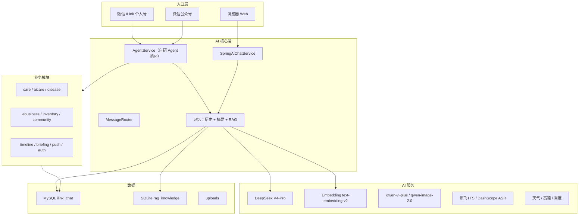
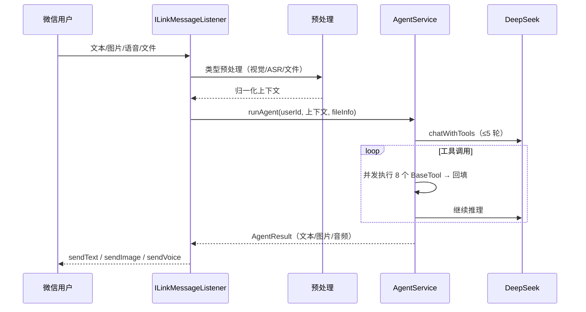

# 微信 ILink × AI 智能助手平台 —— 项目知识文档

> 完整项目知识库：架构、模块、流程、数据库、配置、部署与已知问题。
> 配套文档见文末"相关文档索引"。

---

## 一、项目总览

一个以**微信聊天机器人为主入口**、面向**宠物与绿植护理场景**的 AI 智能助手平台。用户通过微信（ILink 个人号 / 公众号）或浏览器，用文字、图片、语音、文件与 AI Agent 交互：识别宠物/植物、健康评估、护理提醒、天气、生图、语音朗读等；同时配套浏览器端的商城、社区、库存、时间线等 Web 功能。

| 维度 | 内容 |
|---|---|
| 语言 / 框架 | Java 21 · Spring Boot 3.5.14 · Spring AI 1.0.9 |
| 工程形态 | 单模块 Maven（`com.example.demo`，144 个 Java 文件） |
| 前端 | 12 个静态 HTML + 3 个 CSS + 3 个 JS |
| 数据存储 | MySQL（主库 `ilink_chat`）+ SQLite（RAG 向量库 `rag_knowledge.sqlite`） |
| 对话模型 | DeepSeek V4-Pro（OpenAI 兼容接口） |
| 多模态 | qwen-vl-plus（视觉）、qwen-image-2.0（生图）、DashScope ASR、讯飞 TTS |
| 外部服务 | 心知天气、高德地图、百度搜索、WebPush |
| 入口 | 微信 ILink 个人号 · 微信公众号 · 浏览器 Web |
| 部署 | 阿里云轻量服务器（101.37.254.73:8080），systemd 托管 |

---

## 二、目录结构

### 2.1 源码包（`src/main/java/com/example/demo`）

| 包 | 职责 | 文件数 |
|---|---|---|
| `chat` | 对话、会话、记忆（历史/摘要/向量）、实体与仓储 | 38 |
| `care` | 护理域：提醒、记录、问诊、附近服务、护理问答 | 17 |
| `agent` | Agent 循环、8 个 BaseTool 工具、敏感词、异常处理 | 14 |
| `community` | 社区：帖子/评论/点赞/标签 | 8 |
| `weather` | 心知天气接入 + WeatherTool | 7 |
| `ai` | Spring AI 通路：AiController、ToolCallingService、SpringAiTools（24 个 @Tool） | 7 |
| `aicare` | 宠物/植物识别入口（Pet/Plant Controller+Service） | 5 |
| `core` | 微信 ILink 消息监听、文件服务/解析、Web 配置 | 5 |
| `push` | WebPush 订阅/发送 | 4 |
| `inventory` | 库存管理 + 低库存提醒 | 4 |
| `timeline` | 时间线：照片/里程碑/护理记录 | 4 |
| `ebusiness` | 商城：商品/分类 | 4 |
| `config` | DashScope/讯飞/高德配置 + SQLite 双数据源 + 自动建表 | 4 |
| `wechat` | 微信公众号接入 | 3 |
| `disease` | 病害诊断 | 3 |
| `asr` | 语音识别（ffmpeg 转换 + DashScope ASR） | 2 |
| `vision` | 图片分析（qwen-vl-plus） | 2 |
| `router` | 消息路由（LLM 路由 + 关键词兜底） | 2 |
| `briefing` | 每日简报 | 2 |
| `auth` | 注册/登录/会话 | 2 |
| `web` | 页面转发 | 1 |
| `imagegen` | 图片生成/编辑（qwen-image） | 1 |
| `service` | 高德地图服务 | 1 |
| `utils` | JSON 工具 | 1 |
| `tts` | 讯飞语音合成 | 1 |

### 2.2 资源与根目录

| 路径 | 说明 |
|---|---|
| `src/main/resources/application.properties` | 主配置（含密钥，见第八章"密钥管理"） |
| `src/main/resources/db/care_schema.sql` | 原生 SQL 建表脚本（care_reminder / identify_history） |
| `src/main/resources/static/` | 前端 12 页面 + css/js |
| `application-local.properties` | 本地密钥配置文件（**gitignored**，本地和服务器各一份） |
| `落地文档/` | 项目文档（本文件及配套文档） |
| `rag_knowledge.sqlite` | 运行时 RAG 向量库（gitignored） |
| `uploads/` | 运行时上传/生成文件（gitignored） |
| `tmp/` | 历史遗留反编译产物（gitignored，可删除） |
| `login_state.json` | 微信 ILink 登录态（gitignored） |

---

## 三、技术栈与依赖

| 依赖 | 用途 | 备注 |
|---|---|---|
| `wechat-ilink-sdk` 2.1.0 | 微信 ILink 个人号接入 | 第三方 SDK，`ILinkMessageListener` 通过反射探测 `sendVoice` |
| `spring-ai` 1.0.9 | Spring AI 对话通路 | BOM 管理 |
| `dashscope-sdk-java` | 阿里云百炼（文本/视觉） | 实际多数请求走 HTTP 直调 |
| `sqlite-jdbc` + `hibernate-community-dialects` | SQLite 向量库 | 双数据源之一 |
| `pdfbox` / `poi-ooxml` | PDF/Word 解析 | Excel 解析未实现（已知缺口） |
| `web-push` + `bcprov` | WebPush 推送 | 服务器上 BouncyCastle 报错，推送被禁用（已知问题） |
| `weixin-java-mp` 4.6.0 | 微信公众号 | |
| `fastjson2` + `httpclient5` | 自研 AI 通路 JSON/HTTP | 与 `okhttp`、Jackson 并存（冗余，见已知问题） |
| `lombok` | 代码简化 | 已配置 annotationProcessorPaths，命令行可编译 |

---

## 四、架构与核心流程

### 4.1 总体架构



### 4.2 微信消息处理流程



### 4.3 Agent 循环（AgentService）

- 入口：`runAgent`（120s 总超时 + 10s 进度提示）
- 上下文：SYSTEM_PROMPT + RAG 检索（≤3 条 × 300 字）+ 历史最近 10 条 + 8000 字符截断
- 循环 ≤5 轮：`chatWithTools`（重试 3 次）→ 有 `tool_calls` 则并发执行（线程池 ≤4、单工具 15s 超时）→ 回填
- 文本分支兜底：直接工具调用 → 自然语言工具解析 → 关键词强制工具
- 输出优先级：音频 > 图片 > 文本 > 失败
- 每轮结束 `saveMessagePair`：写 MySQL 历史 + 事件驱动异步向量入库/摘要更新

### 4.4 双对话通路

| 通路 | 使用方 | 说明 |
|---|---|---|
| 自研 LlmService | 微信消息、AgentService | fastjson2 + HttpClient5 直调 DeepSeek |
| Spring AI | Web `/api/ai/*` | SpringAiChatService + ToolCallingService |

### 4.5 记忆与 RAG

三层记忆：**MySQL 对话历史（短期）→ LLM 滚动摘要 → SQLite 向量库（长期语义）**。写入走事件异步（`VectorSaveEvent` / `SummaryUpdateEvent`），读取时向量检索注入 System Prompt。

> 详细设计（含 ER 图、写入/读取时序、配置参数）见《项目介绍与记忆RAG系统设计.md》第五章。

### 4.6 护理提醒闭环（2026-08 新增）

- `CareReminderService.sendDueReminders`：每分钟扫描到期 PENDING 提醒，**真正送达**（不再只是改状态）
  - `user_id` 含 `@im.wechat` → 微信 `sendTextToUser`
  - 否则 → WebPush 推送
- `countPendingReminders`：首页"待办提醒"数字来源（`GET /api/ai/care/reminders/pending`）
- 表结构由 `CareSchemaInitializer` 启动时自动创建（读 `db/care_schema.sql`）

---

## 五、工具体系（两套并行）

| 维度 | BaseTool（8 个，自研） | @Tool（24 个，Spring AI） |
|---|---|---|
| 通路 | AgentService（微信） | ToolCallingService（Web） |
| 注册 | 实现 BaseTool + Spring 注入 | 反射扫描 @Tool 注解 |
| 护理域覆盖 | 少 | 全（提醒/用药/分诊/护理计划等 14 个） |

**8 个 BaseTool**：getWeather、webSearch、generateImage、editImage、analyzeImage、analyzeFile、synthesizeSpeech、searchNearbyService

**24 个 @Tool**（SpringAiTools 23 + WeatherService 1）：通用 10 个（getCurrentTime/getWeather/webSearch/professionalSearch/synthesizeSpeech/generateImage/analyzeImage/editImage/analyzeFile/searchNearbyService）+ 护理域 14 个（createCareReminder/completeCareReminder/listCareReminders/queryPetCare/queryPlantSafety/queryFoodSafety/triageSymptoms/saveMedication/checkMedication/compareImages/generateCarePlan/weatherAlert/diagnoseDisease/queryWeather）

---

## 六、数据库

### 6.1 双数据源

| 数据源 | 用途 | 配置 |
|---|---|---|
| MySQL（主） | 业务实体：用户/对话/消息/护理/商城/社区/库存/时间线/推送 | `spring.datasource.*`（SQLiteConfig 中读取） |
| SQLite（次） | RAG 向量库 `vector_store` | `spring.datasource.secondary.url` |

### 6.2 MySQL 表

| 领域 | 表 |
|---|---|
| 账号 | users、user_sessions |
| 对话记忆 | conversations、messages |
| 护理 | care_targets、care_records、identify_history、pet_profile、plant_profile、care_reminder（原生 SQL） |
| 商城 | categories、products |
| 库存 | inventory_items |
| 社区 | community_posts、community_comments、community_likes |
| 时间线 | timeline_entries |
| 推送 | push_subscriptions |

> `care_reminder`、`identify_history` 由 `CareSchemaInitializer` 启动时执行 `db/care_schema.sql` 保证存在（旧库缺列时需手动补列，已在服务器处理）。

### 6.3 SQLite vector_store

`document_id/source_id/content/vector(BLOB float32)/metadata_json/conversation_id/timestamp`；启动时全量加载进内存，检索为余弦相似度线性扫描（top-5，阈值 0.5）。

---

## 七、前端

12 个静态页面，无构建工具，直接 fetch REST API：

登录/注册/首页/聊天/护理/病害/商城(+发布)/社区/库存/时间线

**设计体系**：

- `app.css` v2：登录/注册/聊天 + 全局组件（渐变、玻璃、动画、响应式）
- `shop.css` v2：商城卡片/统计/分页/弹窗
- `index.html`：Liquid Glass 落地页（登录前），已登录自动跳 /home
- `home.html`：参考线上版设计的 Hero + 数据卡 + 核心系统 + 特色功能（含推送开关）
- `modern.css`（27KB）：预留设计系统，**当前未接入任何页面**（可清理或接入）

---

## 八、配置与密钥管理（重要）

### 8.1 配置分区

| 区段 | 内容 |
|---|---|
| DashScope/DeepSeek | 对话（deepseek-v4-pro）、Embedding、视觉（qwen-vl-plus）、图像（qwen-image-2.0） |
| 记忆/向量 | max-messages=10、max-tokens=2000、summary-threshold=3000、top-k=5、阈值 0.5 |
| 数据源 | MySQL url/账号、SQLite 路径 |
| 外部 API | 天气、高德、讯飞、百度、WebPush、微信公众号 |
| 调度 | `spring.task.scheduling.pool.size=3` |

### 8.2 密钥位置（不在此文档列出任何真实值）

| 位置 | 说明 |
|---|---|
| `application.properties` | **当前含明文密钥**（方案 A 已恢复，便于本地运行；推送到 GitHub 前需谨慎） |
| `application-local.properties` | gitignored，本地/服务器各一份（服务器：`/opt/ilink/`） |
| 环境变量（可选） | 部署到其他环境建议用 `${VAR}` 注入 |
| GitHub 仓库 | 推送时为占位符版本（未含明文） |

> 安全提醒：密钥曾进入过 git 历史（早期提交），历史清理与轮换仍建议后续执行。

---

## 九、部署与运维

### 9.1 本地启动

1. 启动 MySQL（库 `ilink_chat`，账号见配置）
2. 确保 ffmpeg 在 PATH
3. 从项目根目录运行：`mvn spring-boot:run` 或 `java -jar target/demo-0.0.1-SNAPSHOT.jar`
4. 控制台出现二维码 → 微信扫码（可选）
5. 访问 http://localhost:8080

> 注意：应用从**项目根目录**启动才能读到 `./application-local.properties`；或使用环境变量注入密钥。

### 9.2 服务器部署（阿里云轻量 101.37.254.73）

- 服务：systemd `ilink.service`（User=admin，WorkingDirectory=/opt/ilink）
- 项目路径：`/opt/ilink/demo-0.0.1-SNAPSHOT.jar`；日志 `app.log`；数据 `rag_knowledge.sqlite`、`uploads/`
- SSH：root 免密密钥（本机 `~/.ssh/wechatilink_deploy_ed25519`）
- 防火墙：22 / 80 / 443 开放

**更新流程**：

```bash
scp target/demo-0.0.1-SNAPSHOT.jar root@101.37.254.73:/opt/ilink/demo-0.0.1-SNAPSHOT.jar.new
ssh root@101.37.254.73
cp -a /opt/ilink/demo-0.0.1-SNAPSHOT.jar /opt/ilink/demo-0.0.1-SNAPSHOT.jar.bak-$(date +%Y%m%d)
systemctl stop ilink
mv /opt/ilink/demo-0.0.1-SNAPSHOT.jar.new /opt/ilink/demo-0.0.1-SNAPSHOT.jar
chown admin:admin /opt/ilink/demo-0.0.1-SNAPSHOT.jar
systemctl start ilink
```

**回滚**：`systemctl stop ilink; mv 备份文件 覆盖 jar; systemctl start ilink`

### 9.3 常见故障排查

| 现象 | 原因 / 处理 |
|---|---|
| `Table care_reminder doesn't exist` | 已由 CareSchemaInitializer 自动建表解决 |
| `Access denied using password: NO` | application-local.properties 未加载（运行目录不对）→ 从项目根目录启动或配置环境变量 |
| Vision 400 `unknown variant image_url` | 视觉请求错发到 DeepSeek → 已修复（走 DashScope 兼容端点 + DashScope key） |
| WebPush unavailable（BouncyCastle/key） | 服务器推送禁用，遗留问题待排查 |
| 生图报鉴权错 | 需确认 `dashscope.image.api-key` 有 qwen-image 权限 |
| 微信消息丢批 | `getUpdates` 只处理第一条（已知问题） |

---

## 十、已知问题与待办

**功能/架构**

- 多用户数据隔离缺失：`PlantProfile/PetProfile` 无 userId，`/api/care/targets` 返回全量
- RAG 检索未按会话隔离（`searchSimilar` 忽略 conversationId）
- `LlmService.chatWithMemory` 存在重复写向量可能
- 消息只处理 `getUpdates` 第一条；`processedMessageIds` 无上限
- 巨型类：ILinkMessageListener（52KB）、AgentService（60KB）
- 商城无购物车/订单闭环；简报不持久化
- 双 HTTP 客户端（okhttp+httpclient5）、双 JSON（fastjson2+Jackson）冗余
- `chat.vectorstore.enabled` 为死配置；`modern.css` 未接入

**安全/合规**

- GitHub 历史含旧密钥 → 清理 + 轮换（挂起）
- `application.properties` 当前含明文密钥 → 推送前确认策略
- ~~接口无鉴权、/uploads 公开~~（2026-08 已修复：新增 WebAuthInterceptor，`/api/**` 与 `/uploads/**` 均需登录；越权问题已收口到"档案归属校验"）

**运维**

- 服务器 WebPush 禁用（BouncyCastle/密钥）
- 服务器微信 ILink 未登录（无 login_state.json）
- 测试仅 contextLoads，无 CI

---

## 十一、变更记录

| 提交/变更 | 内容 |
|---|---|
| `00ba695`（远端旧提交） | 项目初始版本 |
| `08ecbf5` | 取消跟踪 uploads/tmp/login_state/query，更新 .gitignore |
| `d6c72c7`（已推 GitHub main） | 完整项目更新：提醒送达、RAG、前端重设计、密钥外置 |
| 本地未提交（截至本文档） | 密钥恢复回 application.properties（方案 A）；视觉/生图端点修复（DashScope）；本地打包验证 |

---

## 相关文档索引

- 《项目介绍与记忆RAG系统设计.md》—— 介绍 + 记忆/RAG 系统完整设计
- 《绿植与宠物 AI 护理平台 - 前后端对接落地实施文档.md》
- 《Spring AI Alibaba Tools 落地实施指南.md》
- 《🚀 Tavily 联网搜索功能集成落地文档.md》
