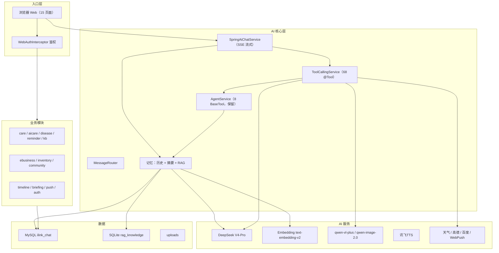
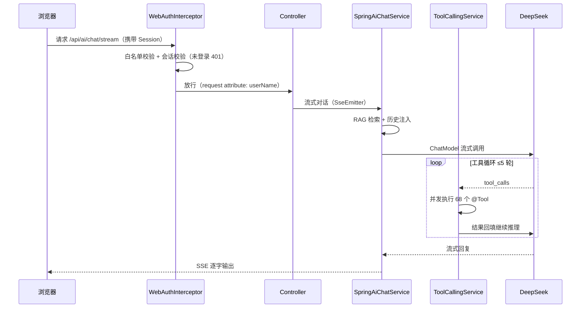

# Sekai PetPlant AI 护理平台 —— 项目知识文档

> 完整项目知识库：架构、模块、流程、数据库、配置、部署与已知问题。
> 配套文档见文末"相关文档索引"。

---

## 一、项目总览

以 **AI Agent 为核心**的宠物/绿植护理 Web 平台。用户在浏览器端通过文字、图片与 AI Agent 交互：识别宠物/植物、健康评估、护理提醒、天气、生图、搜索等；配套商城、库存、社区、时间线、简报、知识库等业务功能。

| 维度 | 内容 |
|---|---|
| 语言 / 框架 | Java 21 · Spring Boot 3.5.14 · Spring AI |
| 工程形态 | 单模块 Maven（`com.example.demo`，141 个 Java 文件） |
| 前端 | 15 个静态 HTML + CSS + JS |
| 数据存储 | MySQL（主库 `ilink_chat`）+ SQLite（RAG 向量库 `rag_knowledge.sqlite`） |
| 对话模型 | DeepSeek V4-Pro（OpenAI 兼容接口） |
| 多模态 | qwen-vl-plus（视觉）、qwen-image-2.0（生图）、讯飞 TTS |
| 外部服务 | 心知天气、高德地图、百度搜索、WebPush |
| 入口 | 浏览器 Web |
| 部署 | 阿里云轻量服务器（101.37.254.73:8080），systemd 托管 |

> 微信 ILink / 公众号接入已于 2026-08-15 移除。

---

## 二、目录结构

### 2.1 源码包（`src/main/java/com/example/demo`，141 个文件）

| 包 | 职责 | 文件数 |
|---|---|---|
| `chat` | 对话、会话、记忆（历史/摘要/向量）、实体与仓储 | 38 |
| `care` | 护理域：提醒、记录、问诊、附近服务、护理问答 | 17 |
| `agent` | Agent 引擎、8 个 BaseTool 工具、敏感词、异常处理 | 14 |
| `community` | 社区：帖子/评论/点赞/标签 | 8 |
| `ai` | Web AI 通路：AiController、SpringAiChatService、ToolCallingService、SpringAiTools | 7 |
| `weather` | 心知天气接入 + WeatherTool | 7 |
| `aicare` | 宠物/植物识别入口（Pet/Plant Controller+Service） | 5 |
| `config` | 鉴权拦截器、DashScope/讯飞/高德配置、SQLite 双数据源、自动建表 | 5 |
| `core` | 文件服务/解析、Web 配置 | 4 |
| `ebusiness` | 商城：商品/分类 | 4 |
| `inventory` | 库存管理 + 低库存提醒 | 4 |
| `timeline` | 时间线：照片/里程碑/护理记录 | 4 |
| `push` | WebPush 订阅/发送 | 4 |
| `disease` | 病害诊断 | 3 |
| `asr` | 语音识别（ffmpeg 转换 + DashScope ASR，保留能力） | 2 |
| `auth` | 注册/登录/会话 | 2 |
| `router` | 消息路由（LLM 路由 + 关键词兜底） | 2 |
| `vision` | 图片分析（qwen-vl-plus） | 2 |
| `briefing` | 每日简报 | 2 |
| `imagegen` | 图片生成/编辑（qwen-image） | 1 |
| `kb` | 知识库管理（上传/分块/向量化） | 1 |
| `service` | 高德地图服务 | 1 |
| `tts` | 讯飞语音合成 | 1 |
| `utils` | JSON 工具 | 1 |
| `web` | 页面转发 | 1 |

### 2.2 资源与根目录

| 路径 | 说明 |
|---|---|
| `src/main/resources/application.properties` | 主配置（仓库内为占位符，真实密钥在本地/服务器） |
| `src/main/resources/db/care_schema.sql` | 原生 SQL 建表脚本（care_reminder / identify_history） |
| `src/main/resources/static/` | 前端 15 页面 + css/js |
| `application-local.properties` | 本地密钥配置文件（**gitignored**，本地和服务器各一份） |
| `落地文档/` | 项目文档（本文件及配套文档） |
| `rag_knowledge.sqlite` | 运行时 RAG 向量库（gitignored） |
| `uploads/` | 运行时上传/生成文件（gitignored） |

---

## 三、技术栈与依赖

| 依赖 | 用途 | 备注 |
|---|---|---|
| `spring-ai` | Web 对话通路（ChatModel） | BOM 管理 |
| `dashscope-sdk-java` | 阿里云百炼（文本/视觉） | 实际多数请求走 HTTP 直调 |
| `sqlite-jdbc` + `hibernate-community-dialects` | SQLite 向量库 | 双数据源之一 |
| `pdfbox` / `poi-ooxml` | PDF/Word 解析 | Excel 解析未实现（已知缺口） |
| `web-push` + `bcprov` | WebPush 推送 | VAPID 密钥已修复并上线 |
| `fastjson2` + `httpclient5` | 自研 AI 通路 JSON/HTTP | 与 okhttp、Jackson 并存（冗余，见已知问题） |
| `lombok` | 代码简化 | 已配置 annotationProcessorPaths，命令行可编译 |

> 已移除：`wechat-ilink-sdk`、`weixin-java-mp`（微信接入相关依赖）。

---

## 四、架构与核心流程

### 4.1 总体架构



### 4.2 Web 请求处理流程



### 4.3 护理提醒闭环

- `CareReminderService.sendDueReminders`：每 60 秒扫描到期 PENDING 提醒，**统一走 WebPush 浏览器推送**（微信渠道已移除）
- `countPendingReminders`：首页"待办提醒"数字来源（`GET /api/ai/care/reminders/pending`）
- 表结构由 `CareSchemaInitializer` 启动时自动创建（读 `db/care_schema.sql`）
- 简报：每天 8 点生成后 `sendPushToAll` 全量推送

### 4.4 记忆与 RAG

三层记忆：**MySQL 对话历史（短期）→ LLM 滚动摘要 → SQLite 向量库（长期语义）**。写入走事件异步（`VectorSaveEvent` / `SummaryUpdateEvent`），读取时向量检索注入 System Prompt；知识库后台上传的文档同样进入向量库参与检索。

> 详细设计（含 ER 图、写入/读取时序、配置参数）见《项目介绍与记忆RAG系统设计.md》。

---

## 五、工具体系（两套并行）

| 维度 | BaseTool（自研，保留） | @Tool（Spring AI，Web 主通路） |
|---|---|---|
| 数量 | 8 | 68 |
| 注册 | 实现 BaseTool + Spring 注入 | 反射扫描 @Tool 注解 |
| 通路 | AgentService（无外部调用方） | ToolCallingService（`/api/ai/chat-with-tools`） |
| 护理域覆盖 | 少 | 全（护理域 14 个 + 业务域 40+） |

**8 个 BaseTool**：getWeather、webSearch、generateImage、editImage、analyzeImage、analyzeFile、synthesizeSpeech、searchNearbyService

**68 个 @Tool**（SpringAiTools 66 + WeatherService 2）：通用能力（时间/天气/搜索/语音/生图/图片分析编辑/文件/附近服务等）+ 护理域（提醒/用药/分诊/护理计划/天气预警/病害诊断等）+ 业务域（商城/库存/社区/时间线/简报/知识库等）

> 完整清单以 `/api/ai/tools/registered` 返回为准；详见《Agent工具调用体系.md》。

---

## 六、数据库

### 6.1 双数据源

| 数据源 | 用途 | 配置 |
|---|---|---|
| MySQL（主） | 业务实体：用户/对话/消息/护理/商城/社区/库存/时间线/推送 | `spring.datasource.*` |
| SQLite（次） | RAG 向量库 `vector_store` | `spring.datasource.secondary.url` |

### 6.2 MySQL 表

| 领域 | 表 |
|---|---|
| 账号 | users、user_sessions |
| 对话记忆 | conversations、messages |
| 护理 | care_targets、care_records、identify_history、pet_profile、plant_profile、care_reminder（原生 SQL） |
| 商城 | categories、products |
| 库存 | inventory_items |
| 社区 | community_posts、community_comments、community_likes |
| 时间线 | timeline_entries |
| 推送 | push_subscriptions |

### 6.3 SQLite vector_store

`document_id/source_id/content/vector(BLOB float32)/metadata_json/conversation_id/timestamp`；启动时全量加载进内存，检索为余弦相似度线性扫描（top-5，阈值 0.5）。对话记忆与知识库文档（`kb_*` 来源）共用此表。

---

## 七、前端

15 个静态页面，无构建工具，直接 fetch REST API：

落地页（index）· 登录注册（login/register）· 首页（home）· 聊天（chat）· 护理（care）· 病害（disease）· 提醒（reminders）· 简报（briefing）· 知识库（kb）· 商城（shop + shop-publish）· 社区（community）· 库存（inventory）· 时间线（timeline）

**设计体系**：

- `app.css`：登录/注册/聊天 + 全局组件（渐变、玻璃、动画、响应式）
- `index.html`：Liquid Glass 落地页（登录前），已登录自动跳 /home
- `home.html`：Hero + 数据卡 + 核心系统 + 特色功能 + 推送开关
- `guard.js` / `common.js`：登录态检查、401 跳转、公共请求封装

---

## 八、配置与密钥管理（重要）

### 8.1 配置分区

| 区段 | 内容 |
|---|---|
| DashScope/DeepSeek | 对话（deepseek-v4-pro）、Embedding、视觉（qwen-vl-plus）、图像（qwen-image-2.0） |
| 记忆/向量 | max-messages=10、max-tokens=2000、summary-threshold=3000、top-k=5、阈值 0.5 |
| 数据源 | MySQL url/账号、SQLite 路径 |
| 外部 API | 天气、高德、讯飞、百度、WebPush |
| 调度 | `spring.task.scheduling.pool.size=3` |

### 8.2 密钥位置（不在此文档列出任何真实值）

| 位置 | 说明 |
|---|---|
| `application.properties` | 本地为明文密钥（便于运行）；**GitHub 仓库为占位符版本**（环境变量注入） |
| `application-local.properties` | gitignored，本地/服务器各一份（服务器：`/opt/ilink/`） |
| 环境变量（可选） | 部署到其他环境建议用 `${VAR}` 注入 |

> 安全提醒：密钥曾进入过 git 历史（早期提交），历史清理与轮换仍建议后续执行。

---

## 九、部署与运维

### 9.1 本地启动

1. 启动 MySQL（库 `ilink_chat`，账号见配置）
2. 确保 ffmpeg 在 PATH（可选）
3. 从项目根目录运行：`./mvnw spring-boot:run` 或 `mvn spring-boot:run`
4. 访问 http://localhost:8080，注册账号即可使用

> 注意：应用从**项目根目录**启动才能读到 `./application-local.properties`；或使用环境变量注入密钥。

### 9.2 服务器部署（阿里云轻量 101.37.254.73）

- 服务：systemd `ilink.service`（User=admin，WorkingDirectory=/opt/ilink）
- 项目路径：`/opt/ilink/demo-0.0.1-SNAPSHOT.jar`；日志 `app.log`；数据 `rag_knowledge.sqlite`、`uploads/`
- SSH：root 免密密钥（本机 `~/.ssh/wechatilink_deploy_ed25519`）
- 防火墙：22 / 80 / 443 开放

**更新流程**：

```bash
mvn -B clean package -DskipTests
scp target/demo-0.0.1-SNAPSHOT.jar root@101.37.254.73:/opt/ilink/demo-0.0.1-SNAPSHOT.jar.new
ssh root@101.37.254.73
systemctl stop ilink
mv /opt/ilink/demo-0.0.1-SNAPSHOT.jar /opt/ilink/demo-0.0.1-SNAPSHOT.jar.bak
mv /opt/ilink/demo-0.0.1-SNAPSHOT.jar.new /opt/ilink/demo-0.0.1-SNAPSHOT.jar
chown admin:admin /opt/ilink/demo-0.0.1-SNAPSHOT.jar
systemctl start ilink
```

**回滚**：`systemctl stop ilink; mv 备份文件 覆盖 jar; systemctl start ilink`

### 9.3 常见故障排查

| 现象 | 原因 / 处理 |
|---|---|
| `Table care_reminder doesn't exist` | 已由 CareSchemaInitializer 自动建表解决 |
| `Access denied using password: NO` | application-local.properties 未加载（运行目录不对）→ 从项目根目录启动或配置环境变量 |
| 未登录返回 401 `{"code":500,"message":"未登录"}` | 正常鉴权行为；前端会自动跳登录页 |
| Vision 400 `unknown variant image_url` | 视觉请求错发到 DeepSeek → 已修复（走 DashScope 兼容端点 + DashScope key） |
| 生图报鉴权错 | 需确认 `dashscope.image.api-key` 有 qwen-image 权限 |
| 收不到 WebPush | 浏览器需重新订阅（VAPID 密钥更换后旧订阅失效） |

---

## 十、已知问题与待办

**功能/架构**

- RAG 检索未按会话隔离（`searchSimilar` 忽略 conversationId）
- `LlmService.chatWithMemory` 存在重复写向量可能
- 巨型类：AgentService（60KB）等
- 商城无购物车/订单闭环；简报不持久化
- 双 HTTP 客户端（okhttp+httpclient5）、双 JSON（fastjson2+Jackson）冗余
- `chat.vectorstore.enabled` 为死配置
- ASR 相关类已无调用方（微信移除后遗留，可清理或用于 Web 语音输入）

**安全/合规**

- GitHub 历史含旧密钥 → 清理 + 轮换（挂起）
- 接口鉴权已上线（WebAuthInterceptor，`/api/**` 与 `/uploads/**` 需登录）；越权已按 `user_id` 归属收口
- 未做接口限流与上传类型白名单校验（建议后续补）

**工程**

- 测试仅 1 个（contextLoads），CI 仅打包不跑测试
- 建议引入 Flyway/Liquibase 替代自动建表

---

## 十一、变更记录

| 提交/变更 | 内容 |
|---|---|
| `d6c72c7` | 完整项目更新：提醒送达、RAG、前端重设计、密钥外置（占位符化） |
| `eb1ffcc` | **移除微信 ILink / 公众号**；新增知识库后台、SSE 流式对话、接口鉴权、简报定时推送、CI；文档更新 |
| `682f5e1` | 合并远端 main，恢复误删的落地文档 |
| `37c726b` | 新增 README.md |
| 本地未提交 | 落地文档同步更新（纯 Web 化） |

---

## 相关文档索引

- 《README.md》—— 仓库入口文档：简介、快速开始、部署、API 概览
- 《Web端功能介绍.md》—— 浏览器端全功能说明
- 《项目介绍与记忆RAG系统设计.md》—— 介绍 + 记忆/RAG 系统完整设计
- 《Agent核心能力设计介绍.md》—— 自研 Agent 引擎设计
- 《Agent工具调用体系.md》—— 68 @Tool + 8 BaseTool 工具体系
- 《Java学习指南-基于本项目代码.md》—— 结合项目代码学习 Java
- 《Spring AI Alibaba Tools 落地实施指南.md》—— Spring AI Tools 入门指南
- 《周报-2026-08-08.md》—— 历史周报（反映当时状态）
- `图片/` —— 架构图、Agent 循环图、RAG 时序图等汇报用图
